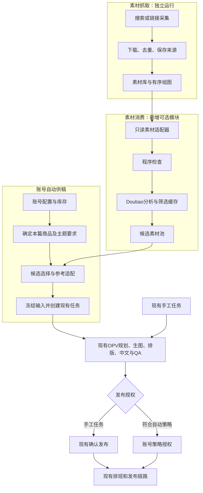

# 账号策略驱动的自动图文供稿 · 开发方案（2026-09-16）

> 本文 = 方案原文（老板批准版，逐字保留）＋ 开发经理代码库对接附注（§附起，已逐条对照仓库核实）。
> 交接给开发模型时整份给出即可。相关背景：`labs/xhs-material-lab/CODEX_INTEGRATION_BRIEF_20260916.md`（素材资产现状）、`docs/XHS_OUTFIT_MATERIAL_INTAKE_PRE_RESEARCH_20260915.md`（预研与隔离设计）。

---

**本轮建设"账号策略驱动的自动图文供稿"，素材抓取与素材消费独立，后半段复用现有 OPV 生产和发布链路。**

## 一、项目背景与目标

当前已有：

- 小红书素材实验室：搜索、下载、入库、有序组图、来源及历史审核记录。
- OPV：图文任务、商品与参考图、穿搭规划、生图、排版、中文回写、质量检查和发布。
- 账号定位、默认主题、视觉预设、真实目标账号传递等基础能力。
- 本机已接入 Doubao，可复用其多图分析能力。

本轮希望实现：

> 配置账号策略 → 自动确定商品与选题 → 选择参考素材 → 自动生成 → 检查 → 排班发布。

日常不要求人工逐篇审选、建任务或确认发布。人工任务继续保留，用于指定商品、特殊主题和临时干预。

本轮不建设复杂推荐、自动选品、账号晋级、数据看板或新的内容中台。

---

## 二、账号配置：三个维度相互独立

账号管理是日常控制入口，不另建后台。

**1. 内容策略：本篇讲什么**

| 选项 | 行为 |
|---|---|
| 定位优先 | 账号定位、默认主题决定方向，再找合适参考 |
| 参考优先 | 从合适素材提炼选题，保留其内容价值并适配 |

定位优先账号没有具体默认主题时，可以在账号定位范围内形成本篇选题，不要求运营逐篇填写。

**2. 商品使用方式：是否使用本店商品**

| 选项 | 行为 |
|---|---|
| 不指定商品 | 根据参考和账号范围生成自由搭配 |
| 使用指定商品 | 从账号配置的产品编码中确定本篇商品 |

第一版支持一个产品编码，或少量产品编码顺序轮换。不做自动选品、销量排序和复杂商品池。

**3. 自动化模式：是否自动执行**

| 选项 | 行为 |
|---|---|
| 关闭 | 不自动创建任务，原流程不变 |
| 自动生产 | 自动补充成片，暂不自动发布 |
| 自动生产并发布 | 合格自动任务进入现有发布队列 |

三者组合应全部支持：

| 内容策略 | 不指定商品 | 指定本店商品 |
|---|---|---|
| 定位优先 | 围绕账号主张生产自由穿搭 | 围绕账号主张及商品选材 |
| 参考优先 | 从参考提炼选题并本地化 | 先确定商品，再从适合参考提炼选题 |

---

## 三、账号表与任务表如何设置

账号管理新增或扩展以下字段，已有字段直接复用：

| 字段 | 说明 |
|---|---|
| 图文内容策略 | 定位优先／参考优先 |
| 商品使用方式 | 不指定商品／使用指定商品 |
| 默认产品编码 | 一个或少量编码；格式沿用现有商品解析能力 |
| 图文自动化模式 | 关闭／自动生产／自动生产并发布 |
| 每日自动生产上限 | 限制新增内容数量 |
| 素材范围，可选 | 收窄素材分类或集合，不必填写 |
| 自动运行状态 | 程序回写原因与状态 |

市场、店铺、类目、受众定位、默认主题、视觉预设和排班继续使用现有配置。

单篇图文任务继续支持现有产品编码、主题、参考图等字段。若需要让一个默认带商品的账号临时生产自由穿搭，增加可选的"本篇商品方式"：

- 继承账号；
- 本篇不指定商品；
- 本篇指定商品。

避免用"产品编码为空"同时表达"继承"和"不使用商品"。

优先级如下：

- **主题：**本篇明确主题 ＞ 定位优先账号默认主题；参考优先且本篇未指定时，从素材提炼。
- **商品：**本篇明确商品方式与编码 ＞ 账号商品配置。
- **视觉预设：**本篇选择 ＞ 账号默认 ＞ 现有入口默认。
- **参考图：**本篇显式参考优先，不被自动选材替换。

账号默认变更作用于新任务；已冻结任务续跑不重新解析默认值。关闭自动发布则停止尚未提交平台的自动任务。

---

## 四、总体架构

职责边界：

| 模块 | 负责 | 不负责 |
|---|---|---|
| 抓取 | 搜索、下载、来源、文件、组图关系 | 创建生产任务、生成、发布 |
| 消费 | 理解、筛选、主题匹配、参考适配 | 浏览器操作、登录、临时抓取 |
| 自动供稿 | 库存补充、额度、幂等建任务 | 复制生成和发布系统 |
| OPV | 现有内容生产、修订、检查、发布 | 依赖采集工具运行状态 |

采集工具及其依赖留在实验室。素材不足时消费侧记录缺口，由抓取侧后续批次处理，不在生产任务中直接启动采集。

---

## 五、素材库读取与自动筛选

第一版使用只读 SQLite 适配器，不部署新服务。

统一素材包至少包含：

- 来源类型、笔记 ID、来源链接；
- 标题、正文、采集分类；
- 有序图片及指纹；
- 下载完整性；
- 历史人工拒绝状态；
- 参考使用权限；
- 素材版本指纹。

适配器负责屏蔽实验室内部表结构。必须检查图片全库去重后，笔记页序和图片引用仍然完整。

人工审选不再是生产前提：

- 人工拒绝素材排除；
- 人工已选素材可优先；
- 未人工处理素材允许机器筛选；
- 机器结果保存在消费侧，不伪装为人工审核。

先用程序处理文件存在性、格式、重复、已分析状态，再由 Doubao 一次完成理解和筛选：

| 提取内容 | 用途 |
|---|---|
| 原笔记主题 | 判断内容方向 |
| 核心单品、搭配关系 | 匹配商品及主题 |
| 组图结构 | 同件多搭、独立合集、分层、对比等 |
| 各页作用 | 封面、完整搭配、细节、解释 |
| 配色、摄影、背景 | 适配视觉预设 |
| 可消费与否、原因 | 自动进入候选池或跳过 |

不确定的信息留空，不凭图推断准确适穿温度、保暖性能或商品材质。拿不准的素材可以跳过，不形成必须人工处理的队列。

---

## 六、先确定商品，再选择参考

指定商品的正确顺序是：

> 解析商品编码 → 读取现有商品资料 → 确定本篇款色 → 选材 → 规划搭配 → 生成。

不能先照参考规划，再替换成自己的商品。

第一版要求：

1. 复用当前商品解析和参考图链路。
2. 多个编码按简单轮换选取，避免每次固定同一款。
3. 款色使用现有商品变体机制；资料不能明确支撑时，不自行猜测。
4. 商品资料缺失则跳过该商品或暂停该账号补货。
5. 不静默降级为自由穿搭。
6. 最终商品身份、颜色、版型与关键细节以本店资料为准。

参考中的商品可以不同，但只能借鉴适用于本篇商品的配套、比例和表达方式。

---

## 七、指定主题如何选素材

在现有主题配置附近增加轻量选材策略，不另建主题管理体系。

每种策略只规定：

- 需要什么信息；
- 优先选择什么；
- 不完全匹配时可借鉴什么。

| 主题 | 优先参考 | 适配注意事项 |
|---|---|---|
| 一衣多穿 | 同核心单品的多套搭配 | 不把不同商品冒充同一件 |
| 旅行·温度穿搭 | 层搭、穿脱、活动线索清楚 | 不凭"冬季"标签推断温度适用性 |
| 温度穿搭／逐层加衣 | 基础层到外层的连续组图 | 不以独立造型合集替代分层 |
| 旅行·配色参考 | 配色关系清楚 | 不改变指定商品颜色 |
| 旅行·拍照穿搭 | 人物、服装、场景关系清楚 | 不复制错误目的地 |
| 四选一 | 可比较、差异明确的造型 | 同造型多角度不算多个选项 |
| 显高类选题 | 腰线、衣长、裤鞋关系清楚 | 不编造显高数值 |

选材采用两步：

1. 程序根据缓存分析、商品和使用历史缩小候选。
2. Doubao 阅读少量候选摘要，确定主参考、必要补充及采用方式。

优先考虑商品与主题可用性，其次账号风格、内容完整性和近期使用。点赞、收藏只是辅助。

优先一篇主参考，存在明确缺口才补其他素材。主题不同可以使用同一素材，但采用信息和叙事应不同。

---

## 八、参考优先如何生产

没有强主题要求的账号，不需要运营填写本篇主题。

程序从适合的素材中提炼选题，例如"灰色穿搭如何避免沉闷"，保留其内容价值，再适配：

- 目标市场语言和受众；
- 人物与账号视觉要求；
- 本店商品要求，如有；
- 当前支持的页数和版式。

自由选题进入现有选题说明，不为每个选题新增 Recipe 或下拉选项。

参考信息分三类处理：

- **穿搭：**单品组合、比例、配色；
- **视觉：**摄影、背景、文字层级；
- **叙事：**问题、示范、解释、总结。

固定背景任务可以借鉴街拍穿搭，但舍弃街景。复杂参考版式可以映射为现有简单布局，不因此临时开发新模板。

没有完全匹配素材时：

| 情况 | 处理 |
|---|---|
| 主题和搭配均适合 | 整体适配 |
| 搭配适合、叙事不同 | 借鉴穿搭，重新组织主题 |
| 版式复杂 | 保留内容，使用已有版式 |
| 商品明显冲突 | 换参考 |
| 缺少足够依据 | 本次不补货，记录缺口 |

指定主题不得静默改成四选一。

---

## 九、输入冻结与现有流程接线

每篇保存最小适配结果：

- 来源素材与选中图片指纹；
- 图片用途；
- 本篇商品、主题；
- 采用和舍弃的信息；
- 实际视觉预设、版式；
- 分析和适配版本。

这些内容在规划缓存计算前进入输入合同。续跑使用冻结值，重新选材或换商品通过明确修订完成。

新增参考输入必须是可选扩展：

- 未启用时不改变旧输入、缓存和路由；
- 不替换手工明确上传的参考；
- 不修改旧任务的冻结快照；
- 不影响围巾、假发、穿搭拆解及旧视频入口。

通过现有任务创建能力接入，不能直接插入业务表绕过校验，也不复制整段 workflow。

---

## 十、Doubao 与成本控制

新增素材模块优先复用 Doubao Seed 2.1。最终穿搭规划、生图和原有 QA 模型暂不调整。

| 环节 | 实现方式 |
|---|---|
| 文件、去重、库存、额度 | 程序 |
| 首次素材理解与筛选 | Doubao 看图并缓存 |
| 候选初筛 | 程序读取缓存 |
| 主题匹配与适配 | Doubao，优先使用文字摘要 |
| 排版 | 现有确定性渲染器 |

控制要求：

- 同一素材分析跨账号复用。
- 长组图分批分析，保留顺序并合并摘要。
- 分析用图适当缩放，必要时才补看细节。
- 不要求长篇报告、完整 OCR 或多轮自我打分。
- 选材和适配尽量合并调用。
- 不默认继承昂贵模型自动兜底。
- 按需分析并限制每轮数量，不一次处理全部素材。
- 记录实际模型、调用次数、Token、图片数量、耗时和重试。

缓存包括素材、模型和分析版本；本篇适配另外包括商品、主题及有效账号配置。

实际费用以当前 API 渠道为准，先做小样用量统计，不承诺未经测量的单篇成本。

---

## 十一、自动供稿与库存

使用现有正式调度方式，新增薄供稿脚本。

每轮：

1. 读取开启自动生产的账号。
2. 检查账号、额度和相关渠道状态。
3. 统计有效库存及生产中任务。
4. 计算本轮补货量。
5. 预留名额和预算。
6. 确定商品、选材与适配。
7. 幂等创建现有任务。
8. 在现有任务表显示来源、方案和结果。

库存合并人工与自动内容，按任务及有效修订去重；失败、废弃修订不计入可用库存。

第一阶段同时支持：

- 无商品自动供稿；
- 固定一个或少量指定商品的自动供稿。

自动选品、复杂商品池和按销量优化后置。

---

## 十二、自动发布授权

当前 release 校验要求人工确认，需要增加独立的账号策略授权分支，原人工分支保持不变。

自动授权绑定：

- 目标账号；
- 自动供稿任务；
- 当前修订、成片指纹；
- 策略版本。

发布需同时满足：

- 账号当前允许自动发布；
- 任务确实来自自动供稿；
- 当前修订质量检查通过；
- 目标账号一致；
- 图片顺序、哈希、文案与 release 清单一致；
- 排班和额度允许。

上传前再次检查停用状态。关闭后停止未提交平台的自动任务；在途任务查询实际结果，不盲目重发。

人工任务仍走原确认方式，不因账号开启自动发布而自动放行。程序授权不能标记为人工审图。

---

## 十三、数据与模块调整

建议新增：

| 模块 | 职责 |
|---|---|
| `material_source.py` | 素材只读适配 |
| `material_analysis.py` | 分析、筛选、缓存 |
| `material_adapter.py` | 商品与主题匹配、参考适配 |
| `auto_photo_supply.py` | 库存补充、幂等任务创建 |
| `auto_photo_authorization.py` | 自动发布授权 |
| 对应脚本 | 预览、执行、恢复 |

消费侧独立台账保存：

- 素材分析缓存；
- 素材使用历史；
- 供稿预留、预算及任务映射；
- 素材缺口。

不复制 OPV 的任务和发布状态机，真实结果读取现有系统。

现有代码修改控制在账号配置解析、规划前可选输入、自动授权与调度接线。新增字段或表采用兼容 migration，不批量改写历史任务。

---

## 十四、异常、幂等与资产隔离

必须具备：

- 供稿名额唯一键、事务预留；
- 重复运行恢复原任务，不重复生图；
- 发布超时先查询，不直接重发；
- 修复与重试计入预算；
- 简单素材轮换；
- 单账号异常不阻塞其他账号。

| 异常 | 默认动作 |
|---|---|
| 素材不适合 | 换候选 |
| 商品资料不足 | 换可用商品或暂停，不改为自由搭配 |
| 单任务修复失败 | 保留并跳过 |
| 排版失败 | 复用源图修订 |
| 素材库不可用 | 暂停自动供稿，手工流程继续 |
| 渠道持续异常 | 暂停该账号补货和发布 |
| 预算耗尽 | 停止新增付费调用 |

日常不增加人工审核。持续无法运行、授权失效等问题才通知运营。

第三方原图仅作参考，不能直接或轻度修改后作为发布兜底。参考资产与生成产物隔离，发布使用正式修订清单；哈希只能辅助检查，不能单独证明使用合规。

---

## 十五、开发分期与验收

| 阶段 | 交付 | 验收重点 |
|---|---|---|
| Phase 1 | 素材适配、Doubao 缓存、商品与主题匹配 | 四种策略组合有效，参考用途正确，成本可记录 |
| Phase 2 | 账号管理、库存补货、幂等台账、自动建任务 | 无需人工建行，重复运行不重复生产，旧流程不变 |
| Phase 3 | 自动授权、排班发布、暂停恢复 | 正确账号发布，停用有效，人工任务兼容 |

首先验证：

1. 同一参考、不同主题，叙事和采用方式不同。
2. 同一主题、不同商品，选材与搭配合理变化。
3. 参考优先账号能自然形成选题，不被强制改成固定主题。
4. 固定背景正确舍弃环境影响。
5. 多账号复用不会重复进行素材视觉分析。
6. 排版和中文使用同一最终文案。
7. 未启用新功能时，现有生产与发布行为保持一致。

随后分别选择一个定位账号、一个参考优先账号，覆盖指定商品与自由搭配，验证少量完整任务，再扩大运行。

**最终运营入口只有现有账号管理表和图文任务表：账号表维护长期策略，任务表用于按需覆盖和查看；日常选材、建任务、生成与发布由程序完成。**

---
---

# 附：开发经理代码库对接附注（2026-09-16，已逐条对照仓库核实）

> 以下为方案与当前代码库的精确对接点与已知坑。方案与附注冲突时，先停下来问，不要自行取舍。

## A. 已核实的落点（方案概念 → 代码位置）

| 方案概念 | 代码落点 | 说明 |
|---|---|---|
| 现有任务创建能力（§九） | `services/task_intake.py` `TaskRequest` + `TaskIntakeService`（INTAKE_CONTRACT=`opv-intake-v1`） | **显式 `idempotency_key` 优先于派生**（task_intake.py:153-158，存 sha256）。`source_type` 是自由字符串（默认 `manual`，飞书来源 `feishu_opv`），新增 `auto_supply` 之类来源是安全的 additive |
| 账号 profile 扩展（§三） | `services/publish_account_profile.py`（resolve 读账号表 `photo_content_profile_json`，种子 `config/publish_accounts/*.json`，`sync_accounts` 构建） | 新增键照"旧快照缺键按旧行为"窄兼容模式（视觉预设 v2 快照先例：`preset_snapshot` 携带有效配置、缺键回退） |
| 只读外部库先例（§五） | `services/asset_resolver.py` 只读 `skills/lightweight-tryon-video/var/light_tryon.sqlite3` | `material_source.py` 照此模式，**不 import 实验室代码**，按统一素材包重新声明查询 |
| 参考输入冻结（§九） | `reference_contracts` 的 `input_sha256` 冻结缓存 | 见坑 2 |
| 自动授权分支（§十二） | `services/release_gate.py`（freeze_photo_release / validate_photo_upload） | 见坑 3 |
| Doubao 接入（§十） | `photo_style_reference_analyzer`（`analysis_method=doubao_seed_2_1`） | 复用其调用与凭证方式；见坑 6 |
| 调度（§十一） | crontab `# BEGIN/END organic_photo_video workers` 两行 + `com.likeu.opv-*` LaunchAgents | 新增 cron/LaunchAgent 属于生产变更，**需用户批准后手动装载**，代码先行 |
| 实验开关先例 | `config/experiments/TH_BASELINE_6RUN_V1.json`（generation_only_first 等） | Phase 1-2 建议挂实验合同默认关 |
| 素材库实体（§五） | `labs/xhs-material-lab/var/material_library.sqlite3`（WAL）+ 图片 `labs/xhs-material-lab/out/download/<note_id>/<note_id>_<seq>.jpeg` | 表结构：`notes`（note_id 唯一/title/description/theme/status/authorization/xsec_token/source_url/like/collected/fetch_status/feishu_record_id）、`note_images`（note_pk+seq 唯一、file_path、sha256 全库唯一）、`fetch_runs`。现状 67 篇/517 图 |
| 飞书审核表（历史人工审选） | wiki `TV1fwhpj7il85VkfBkZciwVBn4g` / `tblrb90WgyvV64tL`（56 行） | 人工拒绝状态回读来源；同步脚本 `labs/xhs-material-lab/scripts/feishu_review_sync.py` |

## B. 六个必知坑（都踩过，别再踩）

1. **幂等键必须显式构造**：派生键=账号+商品+主题+UTC 日期（task_intake.py:74）。自由穿搭（无商品+机器提炼主题）场景下派生键语义不稳，自动供稿必须显式传 `idempotency_key`（建议 `auto_supply:{account}:{yyyymmdd}:{slot或material_note_id}`），并用自己的台账做名额唯一键+事务预留（§十四），两层都要。
2. **input_contract 条件键**：`reference_contracts` 旧缓存链只对「新增键仅出现在新配置任务」安全——所有素材相关新输入必须**条件性加入** input_contract（未启用自动供稿的任务，合同字节必须与旧版完全一致）。验收第 7 条（未启用时行为不变）以此为准，用真实旧任务指纹对比测试。
3. **release_gate 反 AI 审图规则**：人审名字含 codex/chatgpt/assistant 一律拒绝（release_gate.py:118,354）。自动授权走**独立维度**（如 `auto_policy_authorization`），绝不复用/伪装人工确认字段——这与方案"程序授权不能标记为人工审图"一致，是硬校验不是约定。
4. **账号默认变更只影响新任务**：feishu_workflow 在冻结时快照 theme_brief（含定位/视觉基准/指纹），续跑读冻结值不重解析。§三"已冻结任务续跑不重新解析"是现有行为，别破坏。
5. **素材库的授权与去重语义**：`authorization` 全部为 `reference_only`（红线：水印原图/轻度改图永不入发布链）；`note_images.sha256` 是全库唯一（同图跨笔记只存一条）——适配器做"图片引用完整性"检查时按 (note_pk, seq) 取，不要假设每笔记独占图片行。
6. **Doubao 真实调用陷阱（测试）**：supply 测试 fixture 若带 `analysis_method=doubao_seed_2_1` 会触发**真实视觉门禁网络调用**（单测 30-50s 且依赖网络）——fixture 去掉该键并 stub `photo_style_reference_analyzer.validate_style_alignment`（函数内局部导入，patch 源模块）。

## C. 环境事实

- 生产机=本机（Mac mini，darwin-arm64）。OPV 扫描器每 2 分钟在跑——改 `feishu_workflow` 后必须 grep 确认 replace 落位 + `pkill` 旧扫描进程（历史教训：旧进程持旧代码继续消费行）。
- 本机无共享 venv；测试用 `uv run --python 3.12 --with pytest,...` 临时环境。OPV 全量测试基线 1436 绿（2026-09-16 提交 `f1bf7cb` 时点）。
- 改飞书任务表单选选项注意：删选项会清空使用该选项的历史单元格——新增「本篇商品方式」等选项只加不删。
- migration 走 `migrations/0NN_*.sql` 顺序编号（当前到 010），MySQL/RDS。

## D. 开发顺序建议（与 §十五 一致，补充依赖关系）

Phase 1 的 `material_source`/`material_analysis` 完全不碰 OPV 既有文件，可先行独立交付（含台账 sqlite 与成本记录）；`material_adapter` 起开始接触 feishu_workflow 的可选输入接线；Phase 2 动账号 profile + 供稿脚本；Phase 3 才动 release_gate（独立分支）与发布调度。每 Phase 结束跑全量测试 + 一条真实旧任务回归（验收第 7 条）。
