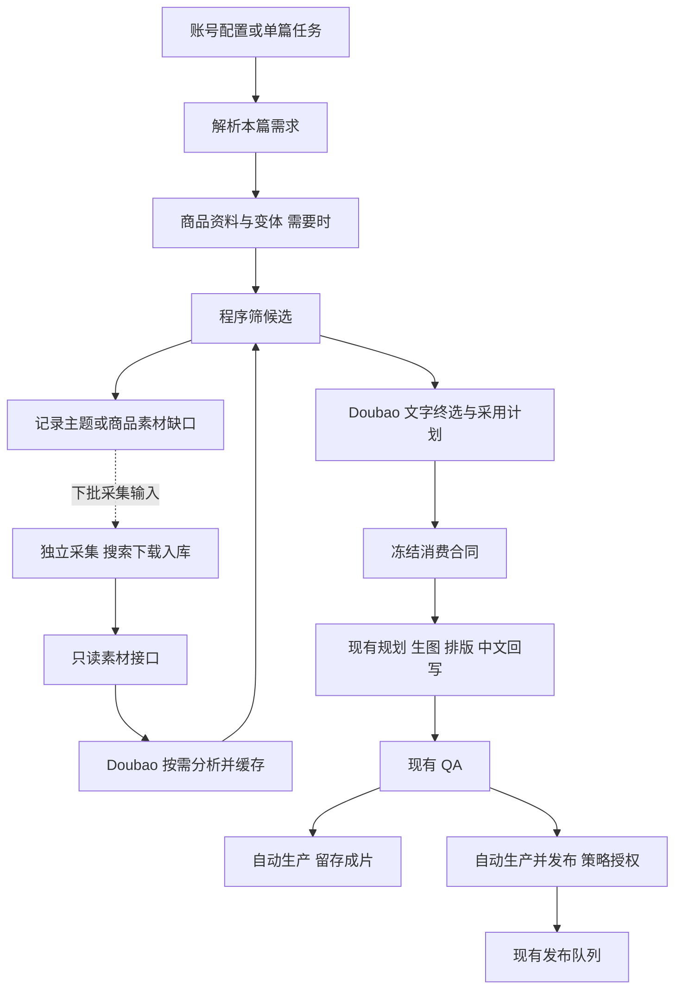

# 自动图文供稿：素材消费收敛与生产闭环修改方案（用户方案原文归档）

> 归档说明：本文为用户 2026-09-16 提供的方案**原文逐字归档**，性质为可交接开发方案，
> 归档时点未执行任何业务代码修改。开发前必须核对分支最新变更；文中描述的新增
> 行为不能当成已经实现。依据文档：`docs/OPV_AUTO_SUPPLY_FULL_REVIEW_20260916.md`、
> `docs/OPV_AUTO_PHOTO_SUPPLY_DEVELOPMENT_PLAN_20260916.md`。
> 开发落点对照与现状差异见文末「附录：开发经理落点说明」。

日期：2026-09-16。性质：可交接开发方案，本次不执行业务代码修改。

依据：`OPV_AUTO_SUPPLY_FULL_REVIEW_20260916.md`、原 `OPV_AUTO_PHOTO_SUPPLY_DEVELOPMENT_PLAN_20260916.md`。开发前核对分支最新变更；本文描述的新增行为不能当成已经实现。

## 1. 背景、范围与交付目标

OPV 已有稳定的手工任务、商品资料、人物包、穿搭规划、生图、排版、中文回写、原生图文发布能力。XHS 实验室已有搜索、下载、入库，OPV 已通过只读接口消费素材、使用 Doubao 分析缓存并自动建任务。最近修复使外部参考真正进入重新生图流程。

当前断点：无主题参考优先仍被写成凉爽旅行；选材缺少账号上下文；分析摘要不足以选具体页面；仅叙事/仅搭配的零外部图片路径不完整；排版渐变错误；并发/重试合同不一致；按库存生产和自动授权发布未接通。

本轮目标：把"有素材"变成"知道怎么用素材"，通过现有流程稳定产出符合账号与商品要求的图文。继续使用 Doubao 做材料理解与文字终选，现有规划/生图路由不整体替换。保留现有 TH、围巾、MX、旧穿搭和手工入口，分阶段启用新消费版本。不要新增内容中台、账号等级、向量库或人工逐篇审核。

## 2. 总体链路及责任边界

采集负责找什么、下载、来源和去重；消费负责为哪个账号、讲什么、参考哪部分。消费不可直接调用浏览器。缺口是异步需求，不是生成任务原地无限等待抓取。

## 3. 资产类型与生命周期：明确什么可以发布

### 3.1 三类资产

| 类型 | 内容 | 允许用途 |
|---|---|---|
| 外部参考包 | 原始笔记标题、正文、图片、页序、来源 | 分析、提炼、作为受控生图参考；本轮一律 reference_only |
| 本店商品/账号人物资料 | 现有商品图、商品事实、变体、人物包 | 商品和人物生成锚点；来源、资格沿用现有系统 |
| 本系统生成资产与成片 | 新生成图片、排版成片、对应 lineage | 通过现有资格检查后入素材库、复用、发布 |

外部原图不能通过修改文件名、裁切、叠字或入库变成可发布资产。资格由来源链决定，不能用"输出 SHA 不同"证明已生成。既有自行上传合格素材复用流程保留，不扩大为任意外部图直接复用。

### 3.2 外部参考的状态与重复使用

原始包保持不可变；更新后产生新指纹，保留原分析历史。消费按"未分析 → 已分析 → 本次可选/不适用 → 被某任务采用"运行。

不设永久 consumed=true：一篇可被不同账号、不同主题、不同采用方式多次借鉴。每次使用记录 note_id、版本、account_id、contract_id、用途、选中页、最终任务与结果。

同账号优先选近期未用、内容角度不同的候选，沿用现有近期窗口做排序即可。候选不足不偷偷把同一篇换页顺序当全新选题；优先从该素材提炼一个实际不同的角度，仍相同时记录缺口、延后该名额。不做全矩阵永久禁用，也不保证轻微变体能规避平台重复判定。

任务失败重试不重复计为新使用；预留、已建任务、完成、失败可从现有台账/任务状态派生，不新增多张业务表。

## 4. 本篇需求的优先级与账号策略

用一个内部 `effective_brief` 汇总现有字段，运营不填 JSON。

**覆盖规则：**明确的本篇字段覆盖对应账号默认；未填写则继承。商品方式必须区分继承、本篇不指定、本篇指定，不能用空编码同时表达继承和禁用商品。本篇覆盖仅影响本任务。

**不可被参考覆盖的事实：**目标市场语言、所选真实商品颜色/版型/细节、明确目的地和温度、账号绑定和输出形式。商品与需求确有冲突时，先换候选；仍无法实现才记录具体原因，不能改商品或编温度。

`effective_brief` 至少包含：账号标识、市场语言、受众/定位摘要、内容策略、本篇明确主题、账号默认主题、商品方式及 snapshot/variant、视觉预设、目的地、明确温度、输出要求、这些字段的来源。

| 策略 | 有本篇明确主题 | 没有本篇明确主题 |
|---|---|---|
| 定位优先 | 围绕该主题选材 | 有账号默认主题就使用；没有则在账号定位内提炼具体选题，不报缺主题错误 |
| 参考优先 | 本篇明确主题作为选材要求 | 从合适素材提炼选题；账号默认主题只作为偏好，不能强制盖掉素材主张 |

希望长期严格围绕默认主题的账号，使用已有"定位优先"，不再新增强/弱主题开关。

参考优先同样受目标买家、类目和风格范围约束。不指定商品不等于什么内容都能用。

将 `topic_statement`（本篇主张）、`recipe_id`（执行结构）、`visual_preset`（背景/视觉）、`template_id`（排字方式）保持语义分开，复用现有字段/JSON。自由选题不新增主题枚举，更不能自动填凉爽旅行或 15–22°C。

## 5. 素材分析：一次分析产出可消费的信息

继续缩图、分批、缓存；不增加新的逐页模型轮次。分析输入加入已有标题和正文，截断后保留主题相关内容；将原文主张与图片可见事实分开，原文不作为保暖效果等商品事实。

扩展当前 analysis JSON：

| 字段组 | 最小内容 |
|---|---|
| 内容价值 | 一句原选题、解决的需求、适合哪些使用方向 |
| 页面 | seq、原角色、可见搭配摘要、outfit_set_id、与其他页的实际变化、可借鉴理由 |
| 组结构 | 独立多搭/同件多搭/逐层加衣/对比/混合；同套多角度不能算多搭 |
| 搭配信息 | 核心单品、上下装比例、鞋裤/裙鞋关系、配色关系 |
| 视觉信息 | 环境、色调、构图特点、装饰元素；与搭配信息分开 |
| 可用用途 | outfit / narrative / visual 的可用性及简短原因；不可见或不确定明确标出 |

取消摄影差导致整篇不可用的通用规则：衣服清楚但自拍感重，可用于搭配文字摘要；摄影好可用于视觉。仅有标题但图片不足以支持搭配判断时，不编造搭配事实。人工明确拒绝仍沿用现有排除行为，但不把"待人工审核"设成必须等待。

缓存键包含图片有序指纹、相关标题/正文摘要、模型和分析版本。修复按 note_id 跳过新版素材的问题。只对入选候选/当前需求需要的历史素材按需补新分析，不全库付费重跑。

## 6. 消费规则：如何选、借什么、如何落到生成

### 6.1 两段选材

第一段为程序筛选：来源和文件有效、可用分析、类目/商品基础相容、至少一个用途可用。账号主题、风格、近期使用记录参与排序。不要要求 outfit_only 的拍摄地必须等于目的地；不按品类名称推断精确适穿温度。

第二段为 Doubao 文字终选：输入完整但简短的 effective_brief 和少量候选摘要，候选必须包含逐页摘要与搭配分组，不能只有页码角色。

一任务先用一篇主参考；暂不引入多篇自动拼接。参考只提供两套有价值搭配时，允许规划补充另外两套，但明确其为新规划，不把未看见的内容归因于原图。

### 6.2 沿用四种采用方式，明确执行差异

| 现有 adoption | 借什么 | 外部图如何进入生成 | 不自动继承什么 |
|---|---|---|---|
| outfit_only | 单品关系、轮廓比例、配色与鞋履搭配 | 默认文字摘要；确需形态信息时只传选中的清晰页面/现有可用细节图；无 detail 页可零外部图执行 | 来源人物、姿态、拍摄地点、贴纸、原文排版 |
| visual_only | 选中的色调、光线、背景或构图 | 只传承载所选视觉作用的少量图，并在角色中说明 | 来源商品、穿搭主题、原文和无关装饰 |
| narrative_only | 提问方式、页面递进、比较/解释逻辑 | 不传外部原图；可照常传本店商品图、人物包 | 原人物、原衣服、原环境；不复制原文 |
| overall | 相容的搭配、叙事及明确选中的视觉因素 | 传实际需要的页面，加结构化采用说明，重新生成 | 不等于全盘复制，不默认采用身份、贴纸和原文字层 |

`overall` 也必须列明实际用途。复用已有"风格/环境/穿搭"参考角色，以角色列表表达组合，不再增加大量 adoption 枚举。视觉风格包含什么写在本次合同，源图出现不代表自动采用。

纯色/室内背景账号可以参考外景图的穿搭；不把外景带入成片。旅行账号借场景时按目的地重新适配；仅借色调无需地点一致。人物继续来自账号人物包，不以小红书作者为身份锚点。

### 6.3 不同主题的消费标准

| 本篇目标 | 消费要求 | 允许的合理适配 |
|---|---|---|
| 指定商品一衣多穿 | 同一真实商品/变体贯穿；下装、内搭或配饰产生实质变化 | 参考不必同款，从其比例和搭配方法迁移，不能把参考主商品冒充本店商品 |
| 无商品一衣多穿 | 从参考或规划建立一个一致主单品 | 不要求存在本店编码；生成后保持该主单品一致 |
| 旅行需求 | 每页回答具体活动、穿脱或搭配需求 | 穿搭可来自异地；真实目的地控制环境。没有温度事实就不写温度范围 |
| 逐层加衣 | 基础层到外层有连续关系 | 普通合集可借单品，但分层叙事由规划明确重建，不能四套不同衣服冒充加衣过程 |
| 配色/比例/鞋履 | 主张明确，每页展示相应关系或变化 | 不必转旅行，不要求四种场景，不强制 A/B/C/D 投票 |
| 自由探索 | 在账号买家与类目内保留素材最有价值的角度 | 简化装饰和本地化表达，不能只换文案而照搬整篇 |

### 6.4 冻结消费合同

扩展 `external_supply_contract` 现有 payload：effective_brief 快照、分析版本、topic_statement、执行结构/视觉预设、采用方式、借鉴点、选中页用途、实际外部图片清单及指纹、商品/人物锚点引用、每页计划、模型与策略版本。

每页计划用现有 content plan 承接：页面角色、要回答的问题、搭配关系、参考页或"新规划"、文字意图、所需参考角色。不要维护另一份完整页面计划。

合同指纹覆盖影响输出的上述内容，不能只覆盖图片与商品。生成使用该合同，不再把已分析素材送入另一个分析器独立重判全部主题；仅在确有缺失信息时调用现有补充分析。

输入校验在付费前完成。已冻结指定商品却清空任务商品字段，应被识别为需求变更，不能静默变自由搭配。人工确需变更时用现有重跑/新 revision 明确生成新合同；旧执行中任务不自动换合同。

### 6.5 没有外部图片时怎么生成

不要往强制要求 STYLE 图片的分支塞空附件，也不要为了通行换成 COMPLETE_LOOK。

由 feishu_workflow 读取合同，根据"实际需要的输入"选择现有生成服务：

- 有外部视觉图：现有参考图生成路径，传角色与限制范围。
- 只有结构化搭配/叙事：现有规划器按 brief 与每页计划规划，再由现有图片生成器执行；商品图和人物图独立附加。

如果现有服务函数强依赖外部图片，只为合同版本新增允许空外部图的适配入口，不全局取消旧手工参考模式的校验。两条路径最终汇合到相同 generated asset、排版、中文、QA 和发布。

### 6.6 无候选与降级规则

先对当前需求范围补有限的未分析素材，再终选；同一轮按配置限制分析数量与调用次数。没有合适参考则记录缺口并跳过名额，不循环换词、换模型、重生。

允许"图片采用转文字采用"，前提是已有可用事实且不改变本篇需求；冻结前由终选说明并由程序检查输入完备。禁止为通行而换主题、改商品、编造温度或偷偷变更 adoption。若该账号要求仅视觉参考而图片不可用，应换候选或记缺口。

## 7. 采集改造：按可用缺口补充

从现有 gap 台账形成按市场/类目/主题需求/商品形态合并的需求清单，不按每个账号复制搜索任务。采集脚本消费清单，仍与生产独立。

先配置少量查询族：同件多搭、旅行穿脱/层次、配色比例、鞋履搭配、围巾搭配；由需求中的实际商品品类/颜色/版型补检索词。本店编码不作为搜索词。目标市场是适配条件，不要求所有参考来自当地。

采集库继续按 note_id 去重，在现有 metadata 增加命中 query 集合和采集时间；不要因第二次搜索命中同篇就丢来源。没有 metadata 容器时再加一张轻量 query-hit 关系表。原分类继续用于组织，不直接作为生产主题。

分析调度优先处理当前活跃需求缺少的素材；已缓存可用库存足够时停止该查询族扩量。以每需求的有效候选数、选择数、完成数和分析用量评估，不增加数据看板。

## 8. 内容、排版与中文回写

每页文案从冻结内容计划产生，解释实际搭配价值，不再统一只写购物/咖啡/散步标签。主问题进入 headline；地点/温度是可选 kicker；投票只在选择型内容需要时作为 CTA。

现有 copy 增加可选结构化 page_texts（headline/kicker/body/cta），排版、中文翻译、manifest、QA 共用同一最终文案源；旧 slide_texts 保留适配，不按换行位置猜新任务语义。

修复 photo_structured_layout 渐变的逐行 alpha 遮罩。保留 clean/scene 两种，不扩更多模板。复用已有底图先验收浅墙、天空、深背景的可读性。

飞书继续使用"内容方案摘要"和"完整文案（中文）"：摘要显示选题、参考用途、主要借鉴点、商品/背景；中文覆盖发布标题、正文、逐页图中文字与 CTA。数据未产生时明确状态，不能把旧文案当新结果。运营不新增填写步骤。

## 9. 自动运行补完与防止重复花费

### 幂等与恢复先于扩大运行

现有 slot 表追加 owner、lease_until、状态或等价字段，用原子获取实现单名额执行所有权；长调用续租，失去所有权的 worker 不能继续产生外部副作用。名额唯一键不等于锁。

重试使用已冻结 intent 的完整输入，不重新随机选材。外部建行标记包含 contract_id/slot。建行请求超时或返回空 ID 属结果未知，先查标记对账，不立即再建；无法确认时暂停该名额等待下轮对账。图片调用若已有 request_id，优先查询/续跑现有任务。

### 库存与预算

以同目标账号的"生成中＋合格待发＋排队中"作为库存，任务/成片按唯一标识去重，包含手工及往日任务；已发布、明确废弃、终止失败不计可用库存。缺口 = 目标库存 - 当前库存，新增量再受每日上限及调用预算限制。缺配置先沿用小额度系统默认，不要求运营维护大量参数。

费用/usage 复用现有调用台账，记录分析、终选、生成调用。先执行调用次数/用量上限，不编造无法获取的实际价格。失败重试也计入额度。

### 自动发布

关闭、自动生产、自动生产并发布三种模式行为必须分开。最后一种在账号开启时形成策略授权；合格自动任务通过该授权进入现有队列，不伪造 human，不逐篇等人工确认。发布前重新检查账号仍开启、revision 合格且未发布、渠道可用。

撤销模式停止后续自动派发，不删除历史任务；已提交到外部平台的发布不能假定可撤回。渠道持续失败时停止继续补新图并保留现有成片。人工任务维持原行为，不因绑定自动账号而自动获得发布授权。

## 10. 文件与实施顺序

包路径均相对 `packages/organic_photo_video/`。新增内部 JSON 字段由程序维护；本地 SQLite 采用幂等迁移，不删除历史缓存/合同。涉及 RDS 字段前先确认现有 JSON 是否可容纳，优先不新增表。

| 批次 | 文件/模块 | 交付与验收 |
|---|---|---|
| A 消费与可靠执行 | services/material_source.py、material_analysis.py、material_adapter.py、external_supply_contract.py、auto_photo_supply.py | 有效 brief、分析 v3、按用途选择、自由选题、完整合同、租约恢复；隔离测试先通过 |
| B 生成与表达 | services/feishu_workflow.py、photo_reference_context.py、photo_style_reference_supply.py、photo_content_planner.py 及实际调用的 copy/translation 服务、photo_structured_layout.py | 零外部图生成、参考边界、内容不被旅行覆盖、结构化文案、中文同源、修复渐变；真实终选样片验收 |
| C 需求驱动采集 | labs/xhs-material-lab/scripts/search_to_library.py、消费侧现有 gap、scripts/run_material_analysis.py、run_auto_photo_supply.py | 查询来源、需求清单、优先补分析；不把浏览器接入生成进程 |
| D 自动运行收尾 | auto_photo_supply.py、publish_account_profile.py、release_gate.py、现有账号同步及发布队列接入点 | 待发库存、预算、自动授权；隔离通过后单账号小量验证，避免直接全量开矩阵 |

开发可将 A 中租约与 B 中渐变先单独修复，但 B 样片必须使用完整新合同。阶段性提交分别可回滚。新功能按消费合同/策略版本启用；旧手工任务和已冻结任务不默认迁移重跑。自动账户仍可随时切回关闭。

## 11. 验收清单

先使用 stub 和临时库覆盖下列语义，不能只测试代码当前默认：

1. 参考优先无主题，配色素材输出配色主张，不出现自动补写的旅行/15–22°C。
2. 定位优先无默认主题，能在已有定位内提炼选题；市场类目等必要事实缺失时才提示配置缺口。
3. 指定商品时参考不得替换颜色、版型；本篇明确"不指定商品"覆盖账号默认商品。
4. outfit_only 只有全身图仍可文字化生产；narrative_only 外部图列表为空但商品/人物图可正常存在。
5. 同造型多角度不误判一衣多穿；一衣多穿固定的是主商品，其余搭配确实变化。
6. 固定背景＋外景穿搭参考不继承外景；只借穿搭不继承 Q 版装饰，明确视觉采用才可加入。
7. 原图永远不能直接进入可发布资产；生成 lineage 与输入合同可追溯。
8. 图片/文本改动造成分析新指纹；重复执行相同合同不重复扣名额或建行。
9. 双 worker、租约过期、建行成功但回写失败、响应超时，均能对账恢复且不产生两条任务。
10. 已有库存时不重复补生产；自动发布授权与人工路径分离；关闭授权后不继续提交。
11. 明暗背景文字可读；内容主标题不是字母投票；中文与最终渲染文本一致。

真实样片用四组组合：定位＋商品一衣多穿；定位＋自由旅行；参考优先＋自由配色；参考优先＋指定商品。使用真实终选，不 monkeypatch 固定素材。至少覆盖一个纯色/室内和一个场景预设。

验收记录对照"原素材 → 提取价值 → 选定用途 → 最终图片/文案"，不是只看生成成功。日常无需运营逐篇审核；开发抽样验收不转成生产审批门槛。先验证内容和可靠性，再按用户授权开启有限自动发布实验。

---

# 附录：开发经理落点说明（2026-09-16，归档时点代码现状）

> 本附录不是方案的一部分，是接手开发前的现状对照。三项基本原则：① 方案 §4/§5/§6.1
> 的部分表述**取代** 2026-09-16 已上线的既有行为（见附B），实现时必须显式替换而不是
> 叠加；② 合同/门禁/页级选材骨架已存在且带测试（见附C），直接扩展；③ 归档时点
> main 分支包含全部既有提交（外部参考执行路径修复、温度一致性、主题推导），未推送。

## 附A. 现状落点表（方案条目 → 代码现状 → 待做）

| 方案条目 | 现状 | 待做（批次） |
|---|---|---|
| §2 链路与边界 | 采集（labs）/只读接口（material_source）/分析缓存/两段选材/合同/建行/生成全链已通 | 仅缺口→采集回环（C） |
| §3.1 资产资格 | 原图直用已封死（供给写「参考图+风格参考」；workflow 付费前门禁 `assert_external_supply_wiring` 禁 COMPLETE_LOOK；staging 兜底拒绝） | lineage 记录扩展（A/B：合同→生成调用→输出指纹链已有雏形，成片级 lineage 待补） |
| §3.2 使用记录 | `material_usage`（note/account/task_ref/adoption）+ `recent_note_ids` 近期降权已有 | 使用记录补 contract_id/选中页/结果状态；**无 consumed 永久禁用**与现状一致 |
| §4 effective_brief | 供给逻辑散在 `_run_slot`（policy/binding/destination/product 逐项读取）；合同已存 destination/product/adoption/温度带 | 新建 brief 对象统一汇总+来源标注+进合同（A）；商品方式三态（继承/本篇不指定/本篇指定）需扩 supply_policy 枚举 |
| §4 主题推导 | 参考优先无主题时已实现**推导→「凉爽旅行」+温度带**（附B-1，将被取代） | 改为 topic_statement 提炼 + theme 不落枚举（A+B 联动） |
| §5 分析 v3 | v2 已有 shoot_style/photography_quality/页角色/搭配要点/审美 consumable 规则（附B-2） | 输入加标题/正文；输出改按用途可用性（outfit/narrative/visual）；逐页搭配摘要+outfit_set_id+页间变化；ANALYSIS_VERSION 升 v3；缓存键加文本摘要；按需补析（C） |
| §6.1 两段选材 | narrow_candidates（结构/品类/审美/近期/季节降权）+ select_reference（文字摘要+页级选材）已通 | 候选摘要升级为逐页+搭配分组；**去掉按品类推断精确温度**（附B-3 的选材侧部分） |
| §6.2 adoption 执行差异 | 四种语义已进合同+内容要求；narrative_only 零图已强制 | outfit_only 默认文字摘要执行（现仍传 detail 页图）；visual/narrative 边界在生成提示里明确（B） |
| §6.4 合同扩展 | external_supply_contracts 已有 adoption/pages+sha256/destination/product/temperature_band/policy_version(v2)+指纹 | 加 brief 快照/分析版本/topic_statement/借鉴点/锚点引用/每页计划关联（A） |
| §6.5 零图生成 | **未实现**——S3、ref3 两次实测均安全阻断于 NEEDS_CONTENT（STYLE 分支强依赖参考图） | feishu_workflow 按合同输入路由：结构化规划→生图，空外部图适配入口（B，先做） |
| §6.6 降级 | 无候选记缺口跳过已有；「图片采用转文字采用」未实现 | 降级规则+程序完备检查（A） |
| §7 需求驱动采集 | gap 台账（material_gaps）已记录 no_material/no_thermal_match 等；搜索脚本参数=主题词 | 查询族+需求清单合并+query-hit 关系（C） |
| §8 结构化文案 | copy 为模板变量式（slide/copy variants），文案与旅行模板耦合（评审发现 A） | page_texts（headline/kicker/body/cta）可选结构 + 中文同源（B） |
| §8 渐变遮罩 | photo_structured_layout 存在逐行 alpha 遮罩错误（评审发现 C，未修） | B 批次先行单独修复 |
| §9 租约 | supply_slots 无 owner/lease_until（唯一键≠锁，双 worker 可能重复建行） | A 批次先行单独修复（幂等迁移） |
| §9 库存/预算 | 台账有调用成本（analysis_call_log）与 slot；无库存视图、无调用上限 | D 批次 |
| §9 自动发布 | automation 枚举已有 关闭/自动生产/自动生产并发布；发布路径未接（原方案 Phase 3 一直未做） | D 批次：策略授权走 release_gate 独立分支（注意 release_gate 反 AI 审核人机制不可绕过） |

## 附B. 本方案**取代**的既有行为（实现时显式替换，勿叠加）

1. **参考优先无主题推导→「凉爽旅行」+15–22°C**（auto_photo_supply `_run_slot` 主题推导块，2026-09-16 深夜上线）：方案 §4 明确"自由选题不新增主题枚举，更不能自动填凉爽旅行或 15–22°C"。替换为主题不落枚举 + topic_statement 提炼；对应测试 `test_reference_first_without_theme_derives_theme` 需同步改写为验收 1（配色素材→配色主张，无旅行/温度自动补写）。
2. **分析 v2 审美硬门槛**（narrow_candidates 排除 mirror_selfie/casual_phone_selfie/poor + consumable 摄影标准）：方案 §5"取消摄影差导致整篇不可用的通用规则"，改为按用途可用性（摄影差仍可文字化借鉴搭配）。v2 的 shoot_style/photography_quality 字段保留作为用途判定输入，淘汰整篇排除逻辑。素材库中 2 篇人工 rejected 维持排除（与方案一致）。
3. **温度带的部分用法**：供给选品热学门禁（商品窗口×本篇明确温度带）与方案 §4"商品与需求冲突先换候选"一致，**保留**；但初筛的标题季节降权与「品类关键词→精确温度窗口」在选材侧的使用按 §6.1"不按品类名称推断精确适穿温度"收敛——季节标签只作粗排序信号，不得当作素材的适穿温度事实；文案温度声明只能来自明确温度事实（没有就不写，S1/S2/S4 的模板温度声明一并去除）。
4. **内容要求模板**：现「参考优先选题：…｜采用方式…｜温度带 15–22°C…」拼装式要求被 §8 结构化 page_texts + brief 取代；过渡期两者共存时以合同字段为准。

## 附C. 已存在、直接扩展的资产（避免重复建设）

- `services/external_supply_contract.py`：合同存储/指纹/迁移骨架（v2）；SUPPLY_POLICY_VERSION 升 v3 时旧合同按版本隔离。
- `services/feishu_workflow.py::assert_external_supply_wiring`：付费前门禁（缺合同/授权异常/COMPLETE_LOOK/产品不一致四种拦截），扩展为合同新字段校验入口。
- `material_adapter.select_reference`：页级选材（pages 校验/去重/narrative 清空）已带测试，升级为逐页摘要输入。
- 供给幂等双层：台账 supply_slots + 飞书「来源标记」对账（`_count_existing_auto_rows`），§9 租约在此基础上加 owner/lease。
- 温度三层（选品门禁/约束注入/封面抽查脚本 `scripts/check_temperature_consistency.py`）：抽查脚本可升级为 QA 钩子的原型。
- 测试基线：1485 passed + 290 subtests（uv run --python 3.12 --with pytest,pillow,requests,httpx,numpy,scipy,pymysql）；关键文件 tests/test_auto_photo_supply.py、test_external_supply_contract.py、test_material_phase1.py。
- 回归样例行：问题行 recvvniddNdPpv/recvvnyHOLaxQ2；S1-S4（recvvnY8ybyhR3/recvvnYaYt8d6E/recvvnYdhVnmHo/recvvo3fqTOLN0）；账号对比行 recvvoj05D1nC7/recvvoj4tQcUcO/recvvoj8KFagzf/recvvojd659NmU/recvvojgwPycSD。测试账号种子 thtest_*（automation=off）可复用于验收 1/2 的账号构造。
- 环境事实：任务表 wiki TR10wxEXHiCYIhk8clActVdenpc / table tblj3x846gU3rshB；消费台账 packages/organic_photo_video/var/material_consumer.sqlite3；素材库 labs/xhs-material-lab/var/material_library.sqlite3（ro）；视觉环境 OPV_PHOTO_VISION_*（.env.local，勿打印）；目标账号下拉选项只加不删（ensure_feishu_task_table.py）；Python 3.9 兼容。

## 附D. 实施顺序备注（对应 §10 批次）

1. **先行单独修复**：A-租约（supply_slots 幂等迁移+原子取锁+续租）、B-渐变遮罩（photo_structured_layout 逐行 alpha）。两者独立可先合。
2. **A→B 依赖**：无主题自由选题需要 B 的主题无关执行入口（travel_two_step 之外的路由或合同驱动），A 的 brief/topic_statement 先行冻结，B 未就绪前旧推导路径降级保留、按策略版本切换。
3. **B 样片硬要求**：使用完整新合同、真实终选（不 monkeypatch——本轮 S1-S4/账号对比用 monkeypatch 固定选材的方式不再作为验收手段）；四组组合沿用 thtest_* 种子账号改造。
4. **C 在 A/B 之后**：缺口清单消费 material_gaps 现有 reason 明细；查询族先落 5 个（§7），采集脚本仍在 labs 隔离环境，MCP 只读三件套纪律不变。
5. **D 最后**：自动发布授权必须走 release_gate 独立分支（反 AI 审核人机制在 release_gate.py:118/354，不得伪造 human 审核记录）；单账号小量验证后再议扩大。

## 附E. 已知待核对疑点（开发前确认）

- §5"修复按 note_id 跳过新版素材的问题"：现缓存按 version_fingerprint 键（note 更新→新指纹→应重析）；疑指 `analysis_failures` 24h 冷却按 note_id 拦截了新版重试，或 list 侧 note 覆盖问题——动手前写复现用例。
- §9"图片调用若已有 request_id，优先查询/续跑"：现生成走同步 HTTP（_DoubaoVisionClient），是否存在可查询的异步任务接口需对 API 文档核实，勿臆造。
- 评审 §4（搜集优化）提到搜索源质量问题：当前搜索纪律=主题词+最多点赞+图文+半年内（2026-09-16 换血后池子 29 篇可消费），C 批次把该纪律编码进查询族配置。
