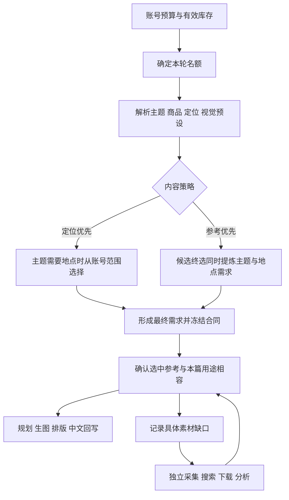

# 下一轮执行方案：账号目的地自动选择与素材消费闭环

方案日期：2026-09-17。业务代码审查基线：`b3404fd`；方案输出时其后提交未修改 OPV/lab 业务代码。依据：`OPV_CONSUMPTION_REVIEW_b3404fd.md` 与此前素材消费方案。本文为开发交接，不代表已实施。

## 1. 背景与本轮交付

目前每日任务由账号预算/库存和内容策略驱动，已有参考分析、终选、自动建行、生成、排版、中文回写。基础调用次数限额、同日合同补绑、常见多篇库存、非旅行配色路由已有修复。

仍有两个核心缺口：

1. 自动任务会读取目的地，却没有完整的账号配置与自动选择链。手工给测试行写日本，只验证了后半段。
2. brief、用途和定向采集需求虽有字段，但有些消费者未收到或未使用，造成“测试配置有值，实际执行没生效”。

本轮完成：账号一次配置目的地范围，自动任务形成具体且冻结的内容需求，按用途消费参考，有缺口则交给独立采集；补齐未知响应、库存和图片额度问题。

不新增运营 JSON、逐篇人工审核、复杂推荐/热门城市排名、实时天气或城市数据库。不重做人物/生图模型/全部模板。不启用尚未完成的自动发布授权；本轮验收成片不等于无人值守发布验收。

## 2. 运营入口和最小数据变更

### 2.1 账号表只新增一个可选字段

字段：**旅行目的地范围**，多选。例如东京、京都、大阪、首尔、上海、北京。仅作为初始可配置选项，不声称它们是当前热度排名；需要时继续加选项。

- 只选首尔：固定首尔，变化主题、搭配和活动。
- 选东京/京都/首尔：适合旅行主题时由程序轮换。
- 留空：保持原行为，不偷偷指派城市；不依赖具体地点的旅行内容和普通穿搭仍可生产。
- 仅设置国家也可兼容，如日本；不要自动替运营补具体城市。

账号受众、主题、视觉预设、商品方式、生产数量继续用已有字段。单篇任务继续使用现有旅行国家/地点字段覆盖，运营无需为自动任务逐篇填写。

### 2.2 账号字段必须完整往返

修改 `skills/short-video-auto-publisher/app/scheduler.py` 中账号字段解析与同步、OPV `services/publish_account_profile.py` 的规范化/白名单/指纹及实际存储读取。

当前 normalize_profile_payload 没有完整目的地字段保留，不能只在生成端读取任意 profile key 就认为已经接好。新增内部 `travel_destinations`，程序保存为稳定ID/国家/城市/展示名列表。目的地变更影响后续内容，应进入对应内容配置指纹；旧未配置账号保持兼容。

国家城市映射用一份轻量配置，兼容日本/东京这类层级。国家和地点明确冲突时返回一次账号配置错误，不猜测修正。用户新增未识别地名时可保留名称、国家未知，不推断虚假地点事实。

迁移原则：复用现有 profile/合同 JSON，数据库仅必要追加字段；不新增 Market/City 业务表，不自动改历史任务。

## 3. 自动选择目的地：明确决策时机

图中缺口→采集→候选是下轮异步补充，不是当前任务无限等待或自动循环重跑。

### 3.1 优先级

已有冻结合同 > 新任务的本篇明确目的地 > 账号目的地范围内选择 > 无目的地。

“冻结合同优先”只针对恢复/重试；人工修改需求走新 revision/合同，不能拿旧冻结值覆盖新任务的明确要求。

固定背景与目的地不是互斥字段：东京旅行可以用纯色讲穿搭，也可以用旅行场景呈现东京。不能因选择城市自动更改视觉预设。

### 3.2 定位优先

明确旅行主题或本篇地点需求时，在终选前选定目的地。沿用现有近期使用台账，优先较少用的地点，同分采用稳定轮转，不新增模型调用。

仅配置目的地范围，但本篇是配色/通勤/一衣多穿时，不强制套旅行地点；是否需要地点由明确主题/任务语境决定，不能只靠“裙子”“咖啡”等零散词改变主题。

账号只有定位、没有具体主题时，终选可在定位内形成本篇主题；把目的地范围和推荐候选传入同一次文字终选，由程序校验最终选择。

### 3.3 参考优先

终选输入账号定位、参考候选与允许的目的地范围，在**同一次文字调用**中返回：本篇主题、是否需要目的地、需要时选哪个允许地点、采用方式。

普通配色题返回无地点；旅行内容才选允许地点。若本篇明确指定地点，终选不得替换。模型不得从范围外自创城市；异常结果可按已确定的主题需要，用程序的稳定候选补齐，不能偷偷改变内容主张。需求矛盾则记具体错误。

这样既避免先强迫自由内容变旅行，也不用新增“先想主题、再选城市”的第二轮模型调用。进入最终规划前，目的地必须确定。

### 3.4 冻结与轮换

在现有 intent 保存已选目的地、来源、账号配置版本和本篇主题。生成重试、飞书绑定重试均复用该选择。名额已提交未知时仍视为占用，不能重新轮换选址。

没有可用当地参考不自动换城市或降低内容要求。仅需搭配/文字场景时可以用通用素材继续；确需环境图又不足时记缺口，等待下轮。不要让“素材哪里多”悄悄决定账号定位。

## 4. 同一份需求贯通筛选、终选与生成

### 4.1 effective_brief 是真实输入，不是事后说明

文件：`services/auto_photo_supply.py`、`material_adapter.py`、`external_supply_contract.py`、内容规划/文案接入点。

brief包含：账号/市场语言/类目、定位、策略、明确主题与默认主题偏好、商品/变体事实、视觉预设、目的地或允许范围、明确温度及来源、需要的参考用途。

筛选与终选必须显式接收；选择后补齐最终选题/目的地，再冻结。测试应检查实际模型 prompt，而非仅查合同列。

本篇主张必须适配实际商品。source_topic 可保留“灰色卫衣8套”，topic_statement 应描述本店浅蓝外套的实际搭配价值，而非只把8改成“多”。标题、正文、逐页文字和中文回写以最终主张为准。

### 4.2 主题、温度、执行结构

- 参考优先的账号默认主题作为偏好，不能无条件覆盖终选主题。
- 参考里出现旅行词不等于15–22°C；只保留本篇明确温度或明确选定温度预设的含义。
- 非旅行切通用结构时不能清除本篇明确温度；若结构无法表达，选择已支持的合适结构或报告不兼容。
- 通用路由按现有市场/类目适配，不能把任何无主题账号都切入TH女装四选一。当前新增通用路由可先明确限定TH女装，其他线沿用已有入口。
- Recipe决定执行，topic_statement决定内容；配色题不必强制投票，一衣多穿不必自动旅行。

## 5. 环境/背景参考的触发规则

### 5.1 目的地文字与图片参考分开

“选择东京”可以只驱动模型规划东京场景，不意味着必须提供东京照片。只有实际选中环境用途时，才将对应外部图片作为环境依据。

| 任务情况 | 外部背景处理 |
|---|---|
| 东京旅行＋旅行场景＋环境采用 | 读取选中图环境，按东京要求适配，排除明显冲突地标 |
| 东京旅行＋纯色/固定室内 | 背景保持预设；目的地影响内容语境、搭配需求与文案 |
| 东京旅行＋首尔穿搭参考，仅OUTFIT | 借衣服组合；原街景不作为背景依据，东京场景另行规划 |
| 自由配色＋外景图 | 不自动形成旅行主题，只借选定配色/搭配 |
| narrative_only | 不传外部图片；自己的商品、人物图仍可使用 |

### 5.2 合同控制用途，视觉分析不能扩大

文件：`feishu_workflow.py`、`photo_reference_vision.py`、`photo_reference_context.py`、`photo_style_reference_supply.py`、`material_adapter.py`。

- 每张 selected page 保存实际允许用途。沿用 OUTFIT / ENVIRONMENT / VISUAL_STYLE 等已有角色，不新增一串组合枚举。
- 用途相交/归一化在一个共享入口完成，传到规划图片清单、生图输入/提示词、QA。既要补漏传参数，也要修“已有模型用途优先”的覆盖逻辑。
- 固定背景屏蔽 ENVIRONMENT；同图保留 OUTFIT/VISUAL_STYLE 时提示词仍以固定背景为准。传整图不能保证模型绝对不受背景影响，必要时采用已有文字化路径，不为此新增强制裁图系统。
- overall=明确选中的多用途，不等于所有用途。narrative 的可用性同样要校验；不把不兼容的视觉需求静默换成叙事需求。
- 可确定性删除非必要的无关维度；若剩余用途不足以实现本篇主张，记具体缺口。不要新增多轮自我修复或人工审核。

验收必须包括：合同仅OUTFIT，视觉模型返回三用途，最后规划/生成仍只有OUTFIT；固定背景不被外景改写；相同图片明确同时采用穿搭与环境时，两者才同时生效。

## 6. 定向采集：统一输入格式并形成需求消退

文件：OPV `scripts/export_material_gaps.py`、`services/material_analysis.py`，lab `scripts/collect_by_demand.py`、`config/query_families.json`。

### 6.1 一份采集需求合同

统一输出 `demands`，每项包含：demand_key、family、主题方向、实际需要用途、商品形态、country/place、地点使用方式、queries、缺口原因。废弃“一个数组给采集器，另一个 ledger_demands 仅导出不消费”的双轨；兼容读取旧文件时先归一化。

零候选、终选无法满足、用途不兼容都记录同一需求；不再固定写三用途或 environment_inspiration。city不能只在brief有、到了需求丢掉。

### 6.2 查询词与使用资格分开

按明确地点、主题、商品组合少量词，例：

- 东京旅行：东京旅行叠穿、日本旅行外套穿脱；保留通用“旅行方便穿脱搭配”。
- 首尔短外套：首尔短外套搭配；通用“短外套不同下装”。
- 上海秋季配色：只有明确秋季时加入秋天；不从目的地猜季节或温度。

只借穿搭也可以用城市词寻找当地风格，但筛选不要求素材真实拍摄地与目标一致。需要环境借鉴时才考虑地标/环境相容。搜索命中地名不是拍摄地证明；普通街景可保持地点未知。

按需求小批搜索，不穷举目的地×主题×商品。相同查询/需求共享结果，运营不用维护每个账号一套搜索词。

### 6.3 判断缺口是否满足

消费初筛与需求统计复用轻量匹配逻辑：用途、结构、实际商品形态，以及必要环境相容。查询族总数只作概览，不能代替具体需求满足。

同件多搭的真实多搭、仅可借鉴单搭分别呈现；需要时允许规划扩展，但不篡改原素材结构。相同需求重新有足够候选时标为已满足/不再导出；需求未满足但刚搜过时使用简单冷却，避免每次运行重复搜索。配置阈值与冷却留在程序，不增加运营字段。

query_hits用稳定family/demand关联，按笔记ID去重；展示名称不作为统计主键。

### 6.4 按需分析接正式入口

`scripts/run_auto_photo_supply.py` 注入实际 analyzer；本轮补分析只执行一次，按相关 note_ids/需求范围限制，不在补出1–2篇后再补一次全库前5。

缓存查询使用当前素材指纹与版本；实际加入标题/正文分析时，指纹覆盖相应文本。仅按需更新候选，保留旧缓存，不全库 force 重跑。

## 7. 自动运行故障保护收口

### 7.1 未知提交与跨日恢复

复用当前合同/slot，补持久化 submitting、unknown 或等价提交状态。请求发送前写提交意图；空响应、超时、进程中断后不直接释放成可重新提交。

每轮先查所有未完成提交，按合同自身日期/账号/slot对账，而非只看today。暂时查空继续保留未知；不能超时一过就认为外部必然没创建。有平台幂等能力则复用；没有时不宣称跨系统严格exactly-once。

未知任务计入该账号在制/待对账库存。持续无法确认时暂停该账号新增并回写原因，其他账号继续；异常告警不是日常人工审批。

已提交任务恢复必须复用原目的地、商品、主张和用途，不因账号池发生变化重新选择。已关闭自动化的账号只对账，不新增生产/发布。

### 7.2 未知库存

扫描返回每账号明确的 inventory_unknown，不能忽略 known=False 后默认零。优先使用现有机器状态，兼容真实“素材重拍 N/M”等进度；不要无限扩张字符串规则。未知只阻止对应账号新增，不阻塞已有任务续跑。

### 7.3 图片额度

视觉分析调用前，在同一短事务预留调用次数和len(batch)输入图片数，成功、已发起失败、未知均占用；缓存命中不占用。独立分析入口和自动供稿共用该逻辑。

继续区分分析输入图片额度与生图额度，不将已有IMAGE_CAP宣传为完整生成费用控制。对模型返回的真实usage记录到相应attempt；缺失记未知。

## 8. 样片表达顺修

只修新通用四宫格，不重做旅行模板：

- D1封面采用独立标题留白区域，缩放/排布既有底图，不能继续把标题画在左上人物脸部；不依赖模型临时避让。
- 内页从已有规划配色关系生成一条简短解释，回应封面“三种公式”的承诺；四套对应三种公式可明确分组，不机械要求数字相等。
- 目的地主题封面/发布标题自然带入已选国家或城市，内页不用页页重复；不虚构个人到访经历。
- 中文回写继续来自最终文字，覆盖标题、正文、逐页文字和CTA；内容摘要显示“本篇目的地＋选择来源＋实际参考用途”。

优先重排D1已有底图验收。生图provider/model/request_id可取到时直接落盘到现有manifest，不能仅以SHA不同证明重新生成。

## 9. 开发批次与验收

| 批次 | 修改范围 | 完成标准 |
|---|---|---|
| A 可靠执行 | 合同/slot、扫描恢复、库存、图片额度 | 响应未知与列表延迟不重建；跨日补绑；未知库存不按零；图片额度不可越过 |
| B 账号与选题 | 账号字段同步、profile、目的地选择、brief/终选、合同 | 飞书配置完整往返；自动选址；参考优先不强旅行；重试地点不变；实际prompt收到brief |
| C 用途与采集 | 用途共享解析、规划/生图/QA、统一demands、按需分析 | 合同用途不能被模型扩大；地点查询被collector真实消费；候选满足后缺口消退 |
| D 排版与综合验收 | 四宫格留白、解释文案、中文、集成测试 | 不压脸；封面承诺被内页回答；下述矩阵通过 |

A可以先独立提交。B/C要联动验收，不能只以字段存在或单函数测试通过结项。各批新增JSON字段由程序维护；必要SQLite迁移仅追加、幂等，保留历史数据。旧合同按原版本恢复，新语义启用新版本；别把进行中任务静默迁移。

### 必须补的跨模块测试

1. 账号多选目的地从飞书解析到profile、持久化、重新读取、brief、行字段均保留；只有一项时固定，留空时不发明地点。
2. 本篇东京覆盖账号首尔默认；同名额重试不换；账号范围修改只影响新任务。
3. 参考优先普通配色不启用目的地；旅行主题能从范围选择；只配置范围不强制所有帖子旅行。
4. 定位/视觉/目的地测试字符串出现在实际终选prompt，而非只在保存的合同中。
5. 合同仅OUTFIT、分析返回三用途，规划与生图实际图片角色仍只有OUTFIT；固定背景环境被屏蔽。
6. 东京环境需求从exporter到collector mock调用再到query_hits；采集分析后重新匹配，满足则不继续导出。
7. 固定背景仅借穿搭，首尔穿搭素材可满足东京内容，不要求当地照片。
8. 零候选正式入口只补一次相关素材分析，不分析无关全库素材。
9. 外部创建成功但空响应、列表暂不可见、跨日、旧worker失租，仍不产生第二条同名额任务。
10. 未知库存只暂停对应账号新增；IMAGE_CAP=1时两图分析不发起。
11. 显式温度不会因通用结构被删除，关键词“旅行”不会自动产生温度。
12. 指定浅蓝外套的最终主张不残留参考灰色卫衣；中文与渲染文字一致。

### 少量真实验收

离线通过后限定三类样片，真实终选，不monkeypatch：

- A：定位旅行账号配置东京/首尔，自动选择其中一个，场景预设；核对选址→实际查询/采用记录→生成。必须检查查询记录，不能用日本背景替代采集验收。
- B：同样有目的地的旅行需求，用纯色/固定室内，允许借异地穿搭；核对背景未被参考覆盖。
- C：参考优先配色，不指定目的地，使用指定商品时实际主张以商品为准；核对通用内容与排版。可复用既有D1底图做排版部分，减少生图调用。

保存实际prompt输入、冻结合同、页面用途、调用记录、最终图片和中文。没有命中某条真实边界时如实写未实测，隔离测试与真实验收分列。

自动发布授权仍是后续阶段，本轮不以“生成完成”标记无人值守发布闭环通过。日常运行不新增逐篇审核；开发阶段抽样验收不转成运营工作。

---

# 附录：开发经理落点说明（2026-09-18，基线核对后）

> 方案已在库（242 行原文）。以下为接手核验的现状对照与执行顺序，开发前先读
> `docs/OPV_CONSUMPTION_REVIEW_b3404fd.md` 的具体发现。

## 附A. 与既有实现的对照（勿重复建设）

| 方案条目 | 现状 | 本轮增量 |
|---|---|---|
| §2 账号目的地范围字段 | profile 无 travel_destinations；scheduler ACCOUNT_FIELD_ALIASES 未含 | 新字段全链（飞书多选→scheduler 别名→normalize/白名单/指纹→存储）；注意 supply_policy 属性白名单曾丢 target_inventory 的教训（b055c77）——新键必须进 default 视图 |
| §3 目的地自动选择 | 供给只读 profile.travel_country（手工测试值）；终选不含地点 | 决策时机前移：定位优先在终选前从范围轮换（复用近期使用台账）；参考优先在同一次文字终选返回主题+是否需要地点+选点（扩 select_reference 输出，程序校验范围） |
| §4 brief 贯通 | brief 已前置（B1）但终选 prompt 未显式接收全量 brief | select_reference 增加 brief 入参（测试查实际 prompt 字符串，方案§9-4）；topic_statement 适配商品（现只泛化计数，未按商品改写主张） |
| §5 用途合同控制 | B3 已做 enforce + untagged_uses；但视觉分析返回的三用途仍可能扩大（评审点名"已有模型用途优先"覆盖逻辑） | 用途归一化单一共享入口；固定背景屏蔽 ENVIRONMENT 已有（_with_background_anchor 一带）需验 prompt 侧 |
| §6 统一 demands | C1 台账 + C3 组合词存在，但 ledger_demands 与族需求双轨、collector 只消费族 | 统一 demands 合同（demand_key 贯穿 collector/query_hits）；需求消退判定；搜索冷却 |
| §7 未知提交/库存/图片额度 | A2 已有 pending_reconcile+slot标记回绑；A3 budget_attempts 有调用级预留但**未按 len(batch) 预留图片数**；inventory known=False 已返回但 run() 聚合可能忽略 | submitting 持久状态+跨日对账（现对账只看 today）；inventory_unknown 账号级暂停；图片数并入同一短事务 |
| §8 四宫格封面 | D1 样片标题压脸（左上人物区） | 通用模板标题独立留白区；内页解释文案回应封面承诺 |

## 附B. 执行顺序

A（可靠执行收口）可独立先提交 → B（账号字段+选址+brief/终选）与 C（用途共享+统一demands）联动验收 → D（排版顺修+综合矩阵）。§9 的 12 条跨模块测试是验收主轴——尤其 4（prompt 实证）、5（用途不被扩大）、6（exporter→collector→query_hits 链）、9（未知提交不双建）、11（温度语义）。真实验收三类样片 A/B/C 按方案限定，可复用 D1 底图做 C 的排版部分。

## 附C. 环境红线（沿用）

release_gate 反 AI 审核人不可绕；发布需人工勾选（自动发布授权仍后续）；原 scipt-generator 未提交改动属其他模型勿碰； miaoshou/浏览器/飞书写入纪律不变；测试后看收集数（if __name__ 追加陷阱已两次）。
