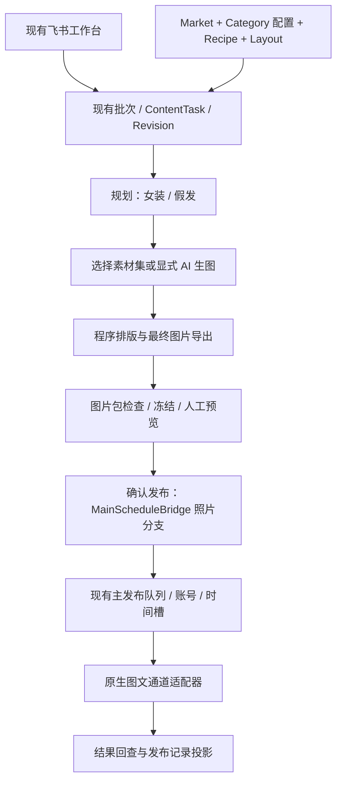

# 图文内容工厂——原生图文 MVP 可交付开发方案

版本：2026-09-05 / 收缩范围版。状态：开发规格，尚未实施。

本方案基于当前工作树及上一轮现状审查，按最新业务决定调整：**直接发布原生图文；取消图片拼视频；账号测试、Benchmark、评分和播放数据回收全部延后。** 原生发布通道已由业务方找到，本方案按这一前提设计；具体通道名称、接口文档与已接代码尚未提供，因此内部发布合同可以冻结，供应商字段映射留在接入任务中完成，不预设其 URL、参数或返回值。

历史依据见[完整现状审查](PHOTO_CONTENT_FACTORY_IMPLEMENTATION_PLAN_20260905.md)。旧文档中的 MP4 优先路径、Benchmark 和数据回收开发安排，由本版范围替代。本文没有执行数据库迁移、生成图片或提交发布。

本版末次复核还发现主发布工作树已有进行中的统一 `PublishRequest` 与 CreatOK 适配代码，以及照片能力/账号时区字段。本方案已将它们纳入复用。它们含未提交改动，本文仅检查而未修改；不据此认定已经部署、完成正式通道联调，或认定用户选择的通道就是 CreatOK。

## 1. 本期交付目标与边界

交付一条可由运营实际使用的流程：

**选择生产预设和数量 → 复用素材或按需生图 → 生成当地语言文案 → 完成图片排版 → 预览及修改 → 确认发布 → 原有主发布队列 → 原生图文通道 → 记录发布结果。**

业务范围固定为 TH 女装、MX 假发；8 个 Recipe，每个先做 1 种执行形式，每篇统一 5 张最终图片。运营可批量生成，不要求每篇绑定具体商品。

| 必须交付 | 建议完成 | 本期暂缓 |
| --- | --- | --- |
| NO_PRODUCT / SOFT_PRODUCT；TH/MX 本地化；8 个配方；素材复用；显式 AI 生图；最终图片包；人工确认；原生多图发布；基本排期；结果与失败恢复 | 每次任务的生图调用数、素材使用记录；可下载图片包；首批文案库；发布前同账号相同图片包提示 | Benchmark Pool/Pack/Run；D1–D3 测试；账号评分与分层；播放/互动采集；实验和统计后台；自动选题；自动 Stable/Explore 比例；实时天气；图转视频；全功能模板编辑器 |

**发布结果回查仍是必须项。** 它只回答“通道是否接受、何时发布、失败原因、帖子在哪里”，不包含“获得多少播放、账号表现如何”。两者必须分开，不能因为延后数据分析而取消发布状态核对。

## 2. 对当前程序的判断

结论：**在现有 `packages/organic_photo_video` 上做局部改造即可，不另建内容系统。生产末端与发布入口需要真正增加照片分支，不能只替换一个 API。**

| 当前能力 | 本期处理 | 对应代码 |
| --- | --- | --- |
| Market、Theme、Recipe、版本化配置 | 继续使用；补 MX、类目与照片规格 | `domain/models.py`、`config/loader.py`、`config/market_packs/`、`config/recipes/` |
| 商品入口和服装规划 | 解除无商品限制；保留女装规划，增加假发规划 | `task_intake.py`、`content_story.py`、`content_planner.py`、`asset_readiness.py` |
| 图片调用、参考图、人物/穿搭/场景 | 复用；补按类目组装 Prompt 与校验 | `image_generator.py`、`asset_resolver.py`、`outfit_planner.py` |
| 图片拼贴与文字能力 | 提取现有 Pillow 排版工具；保证所有最终页文字进入图片像素 | `composite_board_renderer.py`、`board_layout.py`、`text_overlay.py` |
| Task、Shot、Package、Revision、批次 | 全部继续用；照片产物写入 Package 和 Revision | `workflow_v2.py`、`production_batch.py`、`content_package.py` |
| 组图检查、终审、返工 | 保留原图检查；新增最终图片包终审和放行 | `technical_production.py`、`workflow_v2.py`、`release_gate.py` |
| 飞书任务工作台 | 增少量输入和图片包预览；继续执行/确认发布 | `feishu_workflow.py`、`feishu_v2.py` |
| 主发布账号、时间槽、防重复、结果回查 | 复用主发布系统；增加照片候选与渠道适配 | `main_schedule_bridge.py`、`skills/short-video-auto-publisher/app/` |
| 统一 `PublishRequest`、`create_publish_task`、CreatOK 骨架 | 复用已有入口，补完整照片队列贯通；正式协议尚需验收 | 主发布 `app/models.py`、`app/publishers.py`、`app/creatok_publish.py` |
| 指标表、账号测试相关思路 | 保留历史结构，本期不扩展和启用 | `opv_metric_snapshot` 等 |

本次进一步确认的三个绑定点：

1. `domain/contracts.py` 的现有 Plan 要求时长、音频/渲染合同，Recipe 校验还限制固定叙事功能顺序。新增照片合同，不能靠填虚构时长通过旧校验。
2. `TechnicalProductionFlow` 默认经过 `rendering → video_review`；`freeze_release` 核验 `VideoRender`。照片必须走自己的成品图片检查与放行。
3. `RdsRepository.release_revision` 的 `render_id` 参数虽然可空，带审核记录时仍硬查 `scope='render'`。必须改事务内的终审验证，不能省略审核来绕过去。

当前 `text_overlay` 与视频字幕链路中的文字，不保证已经写入源 JPG/PNG。**看到原图或视频预览有文字，不等于直接发布原图也有文字。** 原生交付的验收对象必须是排版后的每个图片文件。

## 3. 推荐架构：少量配置、一条生产链、一套发布队列



各概念的实现决定：

| 概念 | 载体 | 不增加的复杂度 |
| --- | --- | --- |
| Market | 现有 `opv_market_pack`；新增 MX Profile | 不建国家管理系统 |
| Category | `category_key` + `config/categories/*.json` | 不建 Category 表或类目树 |
| Theme | 继续 `opv_theme_catalog`；CHOICE/GUIDE 等保存在配方标签 | 不建第二套 Theme 实体 |
| Recipe | 现有 `opv_content_recipe` + `recipe_spec_json` | 不建 Recipe 新表或 Prompt 平台 |
| Template | 现有 `config/layouts/` 下新增照片布局 JSON | 不建模板表或拖拽编辑器 |
| Asset | 继续图片文件、`opv_content_shot` 和 Revision 选图记录 | 不复制一套媒体仓库 |
| Asset Set | 新增小表 `opv_asset_set`，只管理可复用素材清单 | 不建素材搜索服务和自动标签模型 |
| Content Task / Package / Post | 继续现有任务、包、发布记录 | 不建第二套任务、Post 或发布队列 |

**本期新增业务表 1 张：`opv_asset_set`。** 其余为现有表字段扩展和版本化配置。当前模块名含 `video` 可以暂时保留，飞书显示“图文内容工厂”，无需做目录、导入路径和旧任务的大规模改名。

Recipe 保存内容结构、变量、素材要求、视觉和文案规则；Template 保存画布与各元素位置；Prompt 由执行层生成。第一版每个 Recipe 只开放一个 Template，但记录 `template_id/version`，为以后更换排版保留边界。

## 4. 核心数据合同与执行规则

### 4.1 Recipe 配置

继续通过版本化 JSON 校验并显式导入 RDS；运行时以 RDS 为准。新 Recipe 使用新的版本化 ID，沿用现有 `(recipe_key, recipe_version)` 唯一约束。已被任务引用的版本不可原地覆盖。任务保存完整配置快照，续跑不读取最新配置替换旧计划。

`shot_count/story_structure_json/copy_style_json` 继续表达页数、每页角色与文案；新 `recipe_spec_json` 只补适用范围、变量、素材策略和视觉约束，不再复制一套页面结构。

示例，以下是新配置规格，不是已存在的线上数据：

```json
{
  "recipe_id": "PHOTO_TH_PICK_LOOK_V1",
  "recipe_key": "TH_PICK_LOOK",
  "recipe_version": 1,
  "content_goal": "ORGANIC_ACCOUNT_CONTENT",
  "shot_count": 5,
  "anchor_slot": 2,
  "story_structure_json": [
    {"slot_index": 1, "role": "choice_grid", "source_slots": [2, 3, 4, 5]},
    {"slot_index": 2, "role": "look_a"},
    {"slot_index": 3, "role": "look_b"},
    {"slot_index": 4, "role": "look_c"},
    {"slot_index": 5, "role": "look_d_with_cta"}
  ],
  "copy_style_json": {"locale": "th-TH", "tone": "casual", "max_lines_per_block": 2},
  "recipe_spec_json": {
    "schema_version": "opv-photo-recipe-v1",
    "media_kind": "native_photo",
    "category_key": "womenswear",
    "markets": ["TH"],
    "theme_types": ["CHOICE"],
    "product_modes": ["NO_PRODUCT", "SOFT_PRODUCT"],
    "variables_schema": {
      "scene": {"enum": ["Airport", "Shopping", "Cafe", "Walking", "Photo", "Night"]},
      "style": {"enum": ["korean_clean", "relaxed_travel"]}
    },
    "template_id": "PHOTO_CHOICE_5P_V1",
    "template_version": 1,
    "visual_rules": {"same_identity": true, "same_camera_scale": true, "distinct_looks": 4},
    "asset_policy": {"default": "ASSET_REUSE", "on_missing": "NEEDS_ASSET"}
  }
}
```

新的照片 Plan 使用 `schema_version=opv-photo-plan-v1`，与旧视频合同分支校验：5 页、连续页号、合法素材依赖、冻结变量、当地文案、布局快照；不要求 `audio_policy`、视频时长和 `render_profile_id`。现有质量配置仍可引用。

**页数不等于生图次数。** 例如 Pick 系列先准备 A/B/C/D 四份素材，封面组合这四张，第 5 页在 D 上添加 CTA；不为封面额外生一张图。需要 AI 时，锚点是第 2 页的 A，不是四宫格封面。计划中的素材依赖必须无环，先完成基础照片再排封面。

### 4.2 产品参与度

- `NO_PRODUCT`：商品编码、商品图包可空；依然必须有合格的人物/穿搭或假发素材，或显式选择 AI 生成。无商品不等于无参考、无内容要求。
- `SOFT_PRODUCT`：沿用商品来源；本期操作上要求绑定具体商品编码及有效参考图，保持商品外观，但去掉价格、链接、促销和购买 CTA。泛类目风格素材使用 NO_PRODUCT 即可。
- `PRODUCT_LED`：本期不开放生产预设和挂车流程，不为它新增实现。

禁止给 NO_PRODUCT 填“虚拟商品”以通过校验；禁止在新增假发路径里伪造女装的上衣/裤子/鞋履记录。

### 4.3 三种素材生产方式

| 模式 | 执行 | 缺素材时 | 成本验收 |
| --- | --- | --- | --- |
| TEMPLATE_ONLY | 现有卡片/图片做确定性排版与短文案 | 标记缺素材或变量错误 | 图片模型、抠图模型、文案模型调用均为 0 |
| ASSET_REUSE | 从启用的 Asset Set 选择，组装新内容包 | `NEEDS_ASSET`，保留已选素材 | 图片模型调用为 0，默认规则文案也为 0 |
| AI_GENERATE | 操作员显式选择后，用现有图片适配器补缺的素材 | 明确失败，续跑仅处理未完成素材 | 记录模型、请求 ID、成功及失败调用数；不调用 AI 视频 |

业务界面可只显示“优先复用”和“允许 AI 补图”两个选项，内部按执行步骤记录上述模式。未选择“允许 AI 补图”时，不能偷偷触发生图、AI 抠图或整包重做。特别避开当前 `OutfitDecomposer` 的隐式生图补全。

新增 `reused_asset`、`template_card` producer，复用现有 `generated_photo/composite_board` 的可用部分。Readiness 按类目和生产方式检查；复用已确认的人物图片时，不再要求额外走人物锚点生成。

### 4.4 最小素材集

Asset Set 是“可以一起使用的图片及说明”，不一定等于一篇最终帖子。保存：市场/类目、人物一致性组、配对关系、场景与风格、源文件路径及哈希、可承担页面角色、启用状态。外部导入素材先落入当前文件存储并校验，再登记清单。

一期仅支持人工指定素材集，或对启用素材按类目、市场、角色和标签进行确定性筛选；不做向量检索或自动人脸分类。任务一旦选好即冻结，不因后来素材排序变化而换图。

MX Before/After 必须有配对关系；不能从两个无关人物各抽一张。组合类 Recipe 要求素材组的镜头距离、光线及展示面积接近。重用原图不修改源文件，排版输出另存。使用记录优先写入现有 `generation_lineage_json`，不新增明细表。

## 5. 最终图片包、审核与返工

### 5.1 交付物

每个 Content Task 输出一个独立目录，包含 5 张有序最终图片、标题/正文/标签、预览和 Manifest。批次生成数量 N 表示 N 篇帖子，每篇 5 张；不是 N 张图，也不是预设数再次乘 N。

建议目录：`任务ID/revisionID/final/01.jpg ... 05.jpg`。图像内部基线采用 1080×1920、sRGB JPEG，质量参数配置化，沿用目前竖版方向；**这是内部首版规格，不是供应商限制声明**。实际通道的张数、长宽比、字节数和格式限制由适配器校验，不支持时明确报错，不拉伸人物或截断图片数量。

最终包保存两个不同层次：

1. 原始来源：图片、生成参数、参考图、素材集版本与哈希。
2. 最终发布文件：已经完成裁切、排版、文字叠加的图片及有序清单。

所有泰语、西语标题与 CTA 由程序排版，默认不让图片模型生成文字。首期共用三个基础组件：单图轻文字、双图对比、四图选择。不同 Recipe 组合这些组件，不开发 8 套排版引擎。

字体校验需包含泰语组合附标、断行和西语重音/倒问号样例；字体缺失、字符变方框、文字溢出时停止放行，不能回落默认字体后宣告成功。按布局配置最大行数与区域尺寸检查，不仅依靠字符数限制。

Manifest 必填结构：

| 字段 | 含义 |
| --- | --- |
| `schema_version / media_kind` | `opv-photo-release-v1 / native_photo` |
| `task_id / content_package_id / revision_id` | 唯一来源及已放行版本 |
| `market / category_key / product_mode` | 内容业务维度 |
| `recipe_id / recipe_version / template_id / template_version` | 本次执行的确定配置 |
| `slides[]` | 按 index 1–5 排列；每页含本地文件、SHA256、MIME、尺寸、来源素材 ID 与哈希 |
| `cover_index` | 本期固定 1，和实际首图一致 |
| `copy` | 冻结标题、正文、标签；不能为空时按通道检查 |
| `review_id / input_fingerprint / manifest_sha256` | 终审、输入绑定、发布包校验依据 |

Manifest 哈希对规范化内容计算，排除自身哈希和随后生成的临时上传 URL。标题或正文变更、图片顺序变更、重新排版都要更新 Revision 并重新放行；临时 URL 续期不改变已确认的图片内容。

### 5.2 照片状态流

```text
draft → planned
→ 素材准备（复用直接进入 image_generating；AI 按需经过 hero/anchor）
→ image_review（原图技术检查）
→ photo_packaging（程序排版/最终图片导出）
→ photo_ready（终审通过并冻结，供人工预览）
→ 确认发布
→ publish_preparing → ready_to_publish → publishing → published
```

新增任务状态仅 `photo_packaging`、`photo_ready`，其它沿用现有状态。缺素材用现有失败/待处理展示携带 `NEEDS_ASSET` 和明确缺失项，恢复沿用原批次与任务；不要新造一组素材工作流状态。照片发布完成即为本期完成，不等待 `metrics_collected`；状态展示、runner 和归档条件均需按载体处理。

### 5.3 最终包放行与人工确认

- 原图继续做解码、尺寸、源文件哈希、来源检查。
- 新增 `photo_package` 终审 scope：核验有序最终页、布局/文案指纹、图片可解码、字体可用、内容区域不溢出。通过现有 `QualityReview` 追加记录。
- Revision 的 candidate 类型增加最终图片，建议 `asset_type=photo_slide`、选图键 `slide:1` 至 `slide:5`；原图保留现有来源。终审必须核验最终图，不能只核验 `shot:*`。
- 扩展 `release_revision` 的媒体分支，在同一事务中检查最新终审、active revision、input/selection hash，并冻结包与任务引用。保留并发版本锁，不能绕过旧发布门禁。
- 技术通过后运营在原飞书预览并“确认发布”。人工确认绑定具体 revision/manifest，不以一个不带版本的勾选长期授权所有返工。
- 提交前重验最终文件 SHA256 和 live release；文字或图片被文件系统替换时拒绝上传。

技术检查不声明“文案自然、人物完全一致、穿搭建议正确”。这些通过首批素材/文案验收和每批人工预览处理，不为一期添加昂贵的逐图视觉模型审核。

### 5.4 返工边界

修改短文案/排版：复用原始素材，只重做受影响的最终页和预览。修改某一造型：仅重做该素材及依赖它的封面/页。Before/After 等一致性相关修改按依赖关系重验整组。

未入队任务可创建新 revision；已入队任务复用主队列返工拦截，先确认取消占用；处于提交中、提交结果不明或已排期的任务不能直接覆盖。已发布内容要重新生产时新建任务，不重置历史帖子为待发布。

## 6. TH 女装：4 个配方的实施规格

共用 TH Market、现有女装参考图、Look/Scene/Persona、图片调用和穿搭规划。文案使用现有泰语规则方案补充短句，并由运营确认首批表达。旅行地点/温度是内容变量，不能被 TH Market 的本地热带气候规则覆盖。

| Recipe | 固定 5 页结构 | 变量与素材要求 | AI 边界 |
| --- | --- | --- | --- |
| TH-01 Travel Outfit | 场景 Hook → Look A → B → C → 最佳 Look + CTA | destination、temperature_c、scene、style、height_cm/body_type、season；同人物 3 套衣服，封面/末页可复用 | 已有符合温度和场景的 3 套素材即可零生图；缺特定目的地画面或穿搭时显式补图 |
| TH-02 Petite Styling | Hook → 对照穿搭 → 改善穿搭 → 关键部位标注 → 选择/收藏 CTA | height_cm 150/155/160、styling_rule、coat_length、waistline；对照同人、同镜头、同身体比例 | 有成对素材时零生图；缺配对时生成同人两种穿法，不能靠改身高或拉长腿制造效果 |
| TH-03 Temperature Dressing | 温度 Hook → 内层建议 → 中层建议 → 外层完整 Look → 总结 CTA | temperature_c 15/10/5/0/-5、scene、style、layering_level；适配温度的图与搭配建议 | 可用完整 Look 局部裁切+文字说明，不强制额外抠单品；缺相应造型再补图 |
| TH-04 Pick Your Look | 四宫格 A/B/C/D → A → B → C → D + CTA | 四组 look/color、scene、style，可选 destination；展示尺寸与人物尽量一致 | 4 张既有合格素材即可零生图；首图程序组合，无额外封面生图 |

首批 Travel 变量范围可录入 Seoul/Tokyo/Osaka/Shanghai/Beijing/Harbin 及上述温度；每个变量组合必须命中已验证素材标签，不能把现有薄外套改标题就当作 -5°C 方案。温度建议作为穿搭灵感内容，首批配方须人工检查适配性。本期不接天气 API。

TH-04 优先交付，因为它最容易形成低成本批量产能；TH-02 随后。TH-01/03 使用同一素材和排版基础追加，不扩建旅行或气象系统。

## 7. MX 假发：4 个配方的实施规格

复用任务、Revision、图片适配器、人物参考、素材集、排版、飞书和发布。新增 `hair_planner` 以及头发专用 Prompt/质检规则；**不经过女装的内搭、下装、鞋履和服装拆解流程。**

新增 MX Market，`locale=es-MX`；文案先做审核过的西语短句库。统一变量包括 hair_length、hair_texture、hair_color、bangs、parting、occasion、face_shape_tag、identity_group。`face_shape_tag` 由运营配置，本期不做自动脸型识别。

| Recipe | 固定 5 页结构 | 假发特有要求 | AI 边界 |
| --- | --- | --- | --- |
| MX-01 Before / After | 同人前后对比 Hook → Antes → Después → 清楚的发型细节 → CTA | paired before/after；同脸、光线和镜头，保留脸型及年龄外观；变化集中在头发 | 有配对照片可零生图；AI 修改应以同一人物参考/编辑为基础，不独立生成两张“相似脸” |
| MX-02 Pick Your Hair | 四宫格 A/B/C/D → A → B → C → D + CTA | 4 组发型展示，优先同一模特；头部大小、肩线和镜头距离接近 | 复用 4 张发型图即可；Largo/Bob 等长度和 Liso/Ondulado/Rizado 等纹理分开配置 |
| MX-03 Face Shape Match | 脸型 Hook → 发型 A → B → C → 互动 CTA | 每篇只讨论一种运营标注脸型；同人展示 3 个发型；用建议式表达 | 同人发型组可零生图；不得为了“匹配”改脸或用不同人伪装同人对比 |
| MX-04 Occasion Hair | 场景 Hook → 造型 A → B → C → CTA | cita/fiesta/trabajo/fin_de_semana；突出头发长度、卷度、发色和场景匹配 | 可用发型库加情境文案，默认不为每篇重建派对/办公室背景 |

默认画面为胸像、半身或头发近景，保留完整发顶/发尾；自然发际线、头皮分缝、耳侧与肩部交界是人工检查重点。商品参与时从参考图冻结长度、卷度、颜色等特征，不能直接套女装的 `product_consistency` 规则。

Antes/Después、¿Cuál elegirías? 等短句进入西语词库，西语重音和倒问号需正确渲染。局部细节页可从合格高清原图裁切，但不允许通过过度放大假装获得不存在的细节。

首批优先 MX-02、MX-01；MX-03/04 随后配置上线。新增 VN 发饰等业务时增加 Market/Category、Recipe 和必要的类目规划分支即可，任务/发布链不重建；不承诺任何新类目都完全零代码。

## 8. 数据结构与 migration 清单

以下是目标字段，不是已执行 SQL。迁移编号实施时以仓库最新版本为准；按当前 001–008，可用 009 扩展照片生产/发布映射、010 增素材集。SQLite 遵循主发布库现有 schema 升级方式。

### 8.1 RDS：扩展现有表

| 表 | 调整 | 类型/规则 | 为什么需要 |
| --- | --- | --- | --- |
| `opv_content_recipe` | `recipe_spec_json` | JSON NULL，旧记录按旧合同解析 | 增类目/变量/图片生产与布局规则，复用已有 Recipe |
| `opv_content_task` | `media_kind` | VARCHAR(24)，旧数据默认 `video`，新预设显式 `native_photo` | 路由合同、生产、审核和发布 |
| 同上 | `category_key`、`product_mode` | VARCHAR(32) NULL；新照片任务必填 | 无商品任务也有业务类目；旧任务不推断改写 |
| 同上 | `product_id` 改可空 | 保留原长度/索引；模型 Optional；`product_snapshot_json` 可用空对象 | NO_PRODUCT 无虚拟商品 |
| 同上 | 参数/Template/素材选择快照 | 放入现有 `plan_json` 和 Revision；不再增加同义列 | 续跑与返工可重现 |
| `opv_content_shot` | `duration_ms` 改可空 | 模型读写和合同按载体校验；视频仍必须有效时长 | 原生照片不制造视频时间轴 |
| 同上 | 来源与模式 | 复用 `source_refs_json`、provider/model/request、continuity 等字段 | 追溯原图、复用来源与生成请求 |
| `opv_content_package` | `photo_manifest_json` | JSON NULL，保留 task 一对一 | 当前照片包的最终图片清单；历史版本完整清单仍在 Revision/发布快照 |
| `opv_task_revision` / `opv_quality_review` | 不新增表列，扩展 JSON 类型/审核 scope | 增 photo_slide 候选与 photo_package 终审 | 沿用锁、审核和版本机制 |
| `opv_publish_record` | `render_id` 改可空 | 旧 FK 和非空视频唯一规则保留；照片走下面的新唯一键 | 原生内容没有 VideoRender |
| 同上 | `media_kind`、`content_package_id`、`revision_id` | VARCHAR(24/64/64)，旧值兼容 | 将实际发布绑定到照片包及版本 |
| 同上 | `main_slot_id`、`publisher_account_id`、`publish_channel`、`provider_task_id` | BIGINT / VARCHAR，均兼容可空旧记录 | 主队列槽位、实际账号、通道任务分别保存 |
| 同上 | `publish_key`、`release_manifest_json` | CHAR(64) UNIQUE NULL / JSON NULL | 主队列的幂等归因与完整发布快照 |

继续使用已存在的 `planned_publish_at`、`submitted_at`、`published_at`、`external_post_id`、`external_post_url`、`caption_snapshot_json`，不重复新增同义字段。通道任务 ID 放 `provider_task_id`，真实 TikTok 帖子 ID 才放 `external_post_id`；通道不给真实帖子 ID 时保留空值和原始回执，不能相互冒充。

`opv_publish_record.account_id` 仍指向 OPV 生产 Profile。实际发布账号记录在 `publisher_account_id`，其来源是主发布库账号表，跨 RDS/SQLite 使用逻辑引用，不伪造数据库外键。新增 Package/Revision 引用可设 RDS 外键；验证它们都属于同一 task。`main_slot_id` 为主库逻辑引用。

### 8.2 唯一新增表：`opv_asset_set`

| 字段 | 建议类型 | 说明 |
| --- | --- | --- |
| `asset_set_id` | VARCHAR(64) PK | 每个冻结版本的唯一 ID |
| `asset_set_key / version` | VARCHAR(96) / INT，联合唯一 | 稳定业务名及版本 |
| `category_key / market` | VARCHAR(32) / VARCHAR(16) | 类目与适用市场，market 可空表示经确认可共用 |
| `status` | VARCHAR(16) | draft / enabled / disabled |
| `tags_json` | JSON | 场景、温度、风格、发型等明确标签 |
| `manifest_json` | JSON | 图片路径/哈希/尺寸/角色、源 shot_id、identity_group、pair_id |
| `created_at / updated_at` | DATETIME | 常规审计时间 |

索引先建 `(category_key, market, status)`。JSON 中来源 shot_id 是可空逻辑引用，允许现有手工素材导入。启用前检查文件存在和清单完整；修改素材内容产生新版本，禁用只影响新任务，不改变已有任务快照。

### 8.3 主发布 SQLite：保留现有表名与唯一队列

当前 `video_assets.local_file_path` 在数据库层可空，限制主要在 Python 模型、候选 SQL 和上传路径。因此不必改名整张表，更不能把 JPG 列表拼成一个“视频路径”。

- `video_assets` 增 `media_kind TEXT NOT NULL DEFAULT 'video'`、`photo_manifest_json TEXT NULL`。照片候选的 `local_file_path=NULL`；已有视频路径继续原用法。
- `script_metadata.script_text` 继续承载 OPV 来源、Recipe、冻结 release 和业务信息；无需新建内容元数据表。命名兼容即可，UI 不暴露旧的 video/script 字样。
- `PublishCandidate` 增媒体类型及照片清单，视频路径改为按载体读取；候选 SQL 改为“视频有有效路径，照片有已放行图片包”，按分支做完整校验。
- `publish_slots` 继续拥有实际账号、时间槽、占位、渠道任务与结果状态。`submission_context_json` 冻结照片请求、每张上传回执、release hash 和业务幂等键；新增 `platform_post_id/platform_post_url/published_at` 保存最终结果，旧记录可空。
- 账号仍使用现有 `account_configs`。当前工作树已增加 `provider_connection_uid`、`account_timezone`、`content_photo_capable`、`content_video_capable`、`direct_post_capable`、`delivery_mode` 等，并有发布 Profile 支撑；复用这些字段和对应 schema 升级，不重复建账号/授权结构。选择照片账号要检查照片能力与实际发布模式，不能由 `organic_capable=true` 推断照片一定可发。

保留 `publish_slots` 的 `(account_id, scheduled_for)` 唯一约束、提交占位和现有恢复机制。RDS `opv_publish_record` 是可重试同步的业务投影，**不成为第二个调度真源**。

### 8.4 兼容与上线顺序

先做可空/有默认值的数据库扩展，再上线同时识别旧视频与新照片的代码，最后显式导入新配置。旧任务与已有视频队列按原合同继续运行。新增照片路径用 feature flag 控制；回滚时停止新照片入队并保留数据，不删除表或把照片记录强行变回视频。

## 9. 飞书 UI：在当前工作台上增量调整

当前真实入口是飞书表 `tblj3x846gU3rshB`，本模块没有独立 React/Vue 后台。复用已有的产品编码、生产预设、生成数量、执行、进度、审核、确认发布、重试审核及预览字段。

### 9.1 日常操作

1. 在“生产预设”选择 `TH｜旅行穿搭｜原生图文`、`MX｜四选一发型｜原生图文` 等 8 项之一。预设已经绑定市场、类目、Recipe、Template，无需每次重复选 5 个层级。
2. 填数量 1–9、商品参与度、可选商品编码/素材集、生产方式。配方变量优先用预设默认值，运营只填允许的覆盖项。
3. 执行后查看每个子任务的图片组、文案、素材缺口和生图调用数。修改后重新生成受影响部分。
4. 确认当前版本发布，进入现有发布工作台查看实际账号、时间和结果。

### 9.2 字段最小增量

| 字段/入口 | 改法 |
| --- | --- |
| 生产预设 | 增 8 个照片预设；后台解析市场/类目/Recipe，不要求新建配方管理表 |
| 商品参与度 | 新增 NO_PRODUCT / SOFT_PRODUCT，默认 NO_PRODUCT |
| 生产方式 | 新增“优先复用 / 允许 AI 补图”，默认优先复用 |
| 素材集 | 新增可选 ID 输入或链接；空值走简单确定性筛选 |
| 配方参数 | 新增可选结构化输入，第一版可用经校验 JSON，如 destination/temperature；常用组合做成预设避免运营天天编辑 JSON |
| 产品编码 | NO_PRODUCT 可空，SOFT_PRODUCT 必填 |
| 预览/成片 | 兼容现有字段，照片任务显示“图文预览/图片包”；每个子任务独立分组 |
| 审核/重试审核 | 支持照片页、文案/排版返工；不出现必须视频终审 |
| 确认发布 | 绑定每个子任务的 release；未就绪子任务不纳入确认，回写部分成功和待处理数量 |
| 发布结果 | 复用发布工作台；图文工作台回写账号、排期/发布状态和帖子链接摘要 |

市场/类目可作为只读派生字段方便筛选，避免与生产预设互相矛盾。账号与排期尽量在现有发布工作台处理，不同时扩建两个控制面。

批次 3 篇必须显示 3 组各 5 张图片及各自文案，不能把 15 张附件平铺后由发布器猜分组。优先扩展 `review_preview.py` 的现有预览机制输出索引与逐篇详情，不为此建设完整 Web 后台。

Recipe、Layout 和复杂变量范围第一版由开发维护版本化 JSON，运营通过预设和允许的参数覆盖干预；启停可沿用现有配置状态和素材集状态。双向飞书配置同步、可视化配方编辑器暂缓。

## 10. 原生发布接入合同与状态映射

### 10.1 唯一发布路径

```text
已确认 Photo Package
→ MainScheduleBridge.enqueue_task 的 native_photo 分支
→ 主 SQLite 的内容候选
→ 主 app.scheduler 的既有时间槽/账号能力检查
→ 冻结 slot + release + 实际账号 + 提交请求
→ 用户确定的原生图文通道 adapter
→ 结果回查
→ 更新主队列，并幂等投影到 opv_publish_record / 飞书
```

继续使用 `skills/short-video-auto-publisher/app/scheduler.py`。`packages/organic_photo_video/services/publish_scheduler.py` 是旧 RDS 独立调度路径，当前主工作流已停用；本期不恢复第二个 tick，也不再写一套自动选号器。

`MainScheduleBridge` 新分支读取 `freeze_photo_release`，不要求 render，不构造 MP4。主候选保留稳定 `canonical_script_key=opv:<task_id>`、原来的源记录+task 专属 slot，避免一个飞书批次的第二篇覆盖第一篇。

上传前核验也必须贯通：主 `app.scheduler._validate_opv_upload` 和其调用的 `scripts/check_release_for_upload.py` 当前仍走视频参数/要求 `selected_render_id`。两处均按载体切换最终图片包核验，保留原来的只读子进程、超时处理和安全错误返回；只改 `release_gate.py` 会导致照片继续被外层拒绝。

### 10.2 账号和排期

生产 `account_id` 目前更像内容风格 Profile，不等于实际 TikTok 账号。生成阶段无需指定真实发布账号，预设可继续映射 TH/MX 各自生产 Profile；发布时由既有店铺/账号规则分配并冻结真实账号。

将 `main_publish_routes.json` 从单纯国家默认扩展为优先 `(market, category_key)` 匹配，并兼容旧国家级规则；TH 女装与 MX 假发分别路由至既有正确店铺。缺路由则明确待处理，不回落到 TH/apparel。

首期保留原有日常发布规则和人工排期入口，不加入测试账号锁定、D1/D2/D3 分配或多账号实验矩阵。时间以现有主调度约定存储并显式转换，适配器负责供应商需要的时区；MX 不使用一个未经账号确认的全国统一时区。

同一时间槽只由主队列分配一次。若新通道支持远端定时，提交该槽位时间；若只支持即时发布，由同一主 worker 到期提交。供应商任务是该槽位的执行回执，不是另一套独立排程。

即时通道需明确改动主调度的到期规则：当前代码有提前 30 分钟的提交门槛，pending 查询也按未来槽位窗口选择，直接沿用会让到期照片永远无法提交。按渠道 `supports_scheduled_submit` 分支处理提前提交与到期提交；即时分支读取已到期未提交槽位，采用明确的宽限/错过时间处理，并保留槽位占位及对账。不得通过把时钟或排期伪造到未来来绕开检查。

若实际通道只能即时发布，建议同一主 worker 的到期巡检配置为 60 秒、允许迟到窗口为 10 分钟；超过窗口且确定未提交的槽位转人工重排，不补发积压内容。两项均为可配置运行参数，需纳入该通道联调验收；支持远端定时的通道沿用现有巡检，不为它增加上述运行要求。

### 10.3 Adapter 内部接口

**复用现有 `PublishRequest` 与 `BasePublishAdapter.create_publish_task`，不再新增一套对外发布入口。** OPV 的 `media_kind=native_photo` 在桥接处映射为 `PublishRequest.content_type='photo'`，`commerce_type='organic'`，`media_paths` 为冻结的有序最终图片；复用 `account_id/title/publish_at/timezone/delivery_mode` 等字段。当前 scheduler 仍构造 `content_type='video'`，需要改成媒体分支。

以下为适配层必须满足的职责，可作为已有 adapter 的内部方法，不是要求平行建设四个公共接口，也不是供应商 API：

| 方法 | 输入 | 输出与职责 |
| --- | --- | --- |
| 现有能力查询/配置 | 实际渠道账号 | 原生图片张数/格式/大小、无商品发布、是否支持定时/查询/音乐等明确能力 |
| 图片准备内部方法 | 冻结最终图片与已有上传回执 | 顺序一致的可提交媒体 ID/URL；上传失败可逐张恢复 |
| 现有 `create_publish_task(request)` | PublishRequest + 已持久化的提交上下文 | 可恢复的 provider_task_id 或明确的未提交/结果不明错误；不可只返回真假 |
| 现有 `query_task_status` 及上下文恢复方法 | 渠道任务或幂等上下文 | pending/published/failed/unknown/待账号确认，真实帖子 ID/链接/时间（可获取时） |

扩展现有 `PublishTaskStatus` 返回真实帖子 ID/URL 及必要的未知结果标志，避免在 adapter 边界丢失。`inbox/待账号确认` 必须单独显示，不计为自动发布成功；本期自动发布验收使用支持直接发布的实际账号和通道模式。现有 CreatOK 骨架可复用请求、Profile、提交上下文和状态解析，但它明确保留正式 envelope 样例未验证时的提交阻断，联调前不能视为已完成。

若需要公开图片 URL，复用现有可访问的媒体存储能力，上传回执持久化；本地文件路径不能直接发给远端 API。链接有效期必须覆盖远端抓取/排期窗口，重试上传可刷新 URL，但不得换图片或乱序。

封面默认第一张。配乐只在通道原生支持时传媒体/音乐标识，本期不强制热门 BGM，不跑视频音轨、混音和节拍逻辑。若通道有必填音乐或 AI 内容声明等字段，作为 adapter 能力配置显式处理，不能静默丢弃。照片候选不得进入当前视频 BGM 等待门禁。

### 10.4 幂等与失败恢复

- 首次入队冻结稳定任务、revision、release hash；分配槽位时冻结实际账号、channel、排期与提交身份。重复点击确认只返回原候选/槽位。
- 沿用主队列提交前原子占位。业务发布键基于已冻结 task/revision/channel/actual account，重试沿用；不以每次新时间戳生成新发布键。
- 记录每张图片上传回执和有序映射；局部上传失败仅处理缺失或失效项。
- 上传过程每得到一项回执，就通过 slot ID/占位身份更新 `submission_context_json`，不能只保存在 adapter 内存直到最后才返回。若实际渠道接收一整个媒体清单、不给逐张回执，则保存原始媒体清单与整次操作身份，按它的可恢复协议处理。
- 通道已接受后的超时、空响应、进程中断或落库错误一律保留占位并进入“提交结果不明”，先查回结果，不能自动重新发帖。
- 未取得渠道任务 ID 时，使用提交前已经落库的 `idempotency_key/operation_id` 查询；worker 必须能扫描这些无 task ID 的占位。若渠道不提供此类查询或可靠幂等保障，则转人工核对，不能只依赖现有“有 task ID 才 query”的扫描。
- 复用主发布已有 `reconcile_scheduled_task(frozen_context)` 恢复入口；adapter 提交/重试读取已持久化 context，不重新生成 operation ID。当前 CreatOK 骨架仍有重建 context 的代码，必须完成接线后才能声称支持该恢复路径。渠道与实际连接身份一起冻结；运营后来切换账号渠道时，旧槽位仍交给原渠道对账。
- 只有确定尚未提交、或渠道明确失败且允许重试的情况，才按现有有限重试规则恢复。无法可靠查询时转现有人工核对，不能把“没有收到 ID”当作“没有发出去”。
- `queued/accepted` 只表示已受理/已排期，不能显示已发布。发布完成必须来自可核验的通道结果或有记录的人工核对。
- 主队列已发布但 RDS/飞书写回失败，仅重试投影，不再次发布。按 main slot/publish key upsert 保证重复回查不产生重复记录。

### 10.5 渠道接入任务的明确输入

开发接入需要：通道名称与文档/已有代码位置、TH/MX 可用账号映射、无商品多图样例、上传/提交/查询样例、图片限制、时间格式和返回状态。这些决定 adapter 映射和联调工期，不改变本方案的生产端结构。

当前尚未提供这些具体资料，因此不能声称“已有代码已兼容该通道”或给出未经验证的供应商请求。交付验收必须接到用户指定的实际通道；Mock/导出包通过只算开发阶段完成，不算自动发布交付完成。

## 11. 开发任务拆分与验收

路径以 `packages/organic_photo_video/` 为默认前缀；主发布模块另标全路径。下列新增文件名为建议名称，开发可以按现有组织方式合并，职责与验收不变。

### Phase 1：打通照片生产与成品放行

| 工作项 | 文件/模块 | 交付和验收 |
| --- | --- | --- |
| 照片合同、NO_PRODUCT 与模型迁移 | `domain/models.py`、`domain/contracts.py`、`domain/statuses.py`、`repositories/rds_repository.py`、新 migration；`task_intake.py/content_story.py` | 无商品可建照片任务；照片不要求视频音频/时长；旧视频合同仍生效 |
| 素材集与零生图路径 | 新 `services/asset_set_service.py`；`shot_producer_router.py`、`asset_readiness.py`、`hero_first.py` | TH/MX 各用手工选定素材完成一篇；禁用生成适配器时仍成功；缺素材明确待处理 |
| 最终图片导出 | 新 `services/photo_package_exporter.py`；复用 `composite_board_renderer.py/board_layout.py/text_overlay.py/content_package.py` | 5 张有序图片、文字实际入像素、可逐篇预览；不生成 MP4，不创建 VideoRender |
| 图片包终审与返工 | `workflow_v2.py`、`technical_production.py`、`release_gate.py`、`scripts/check_release_for_upload.py`、Repository | 终审绑定最终图片/文案/布局；篡改文件、换序、旧审核并发放行均被拦截；改文案不重新生图 |

先用 TH Pick Your Look、MX Pick Your Hair 验证公共链路；不等 8 个内容配方全部完善才验证最终图片包。

### Phase 2：接入主发布并让运营开始使用

| 工作项 | 文件/模块 | 交付和验收 |
| --- | --- | --- |
| 主队列识别照片 | `services/main_schedule_bridge.py`、`config/main_publish_routes.json`；主发布 `app/db.py`、`app/models.py`、`app/scheduler.py`、`app/capabilities.py` | 只产生一套槽位；照片候选无需视频路径；上传前子进程可验证照片；TH/MX 路由正确；视频队列回归通过 |
| 实际原生通道适配 | 主发布 `app/publishers.py`、现有 `PublishRequest`；按指定通道复用 `app/creatok_publish.py` 或补对应 adapter | 指定账号接收完整有序 5 图；标题文案正确；任务 ID 与帖子 ID 分开；按通道能力完成定时或到期提交；待账号确认不冒充已发布 |
| 结果回查与归因投影 | 主发布 scheduler/adapter + OPV Repository/现有同步入口 | 排期与已发布区分；投影失败可恢复且不重发；未知结果保留占位 |
| 飞书增量 UI | `scripts/ensure_feishu_task_table.py`、`feishu_workflow.py`、`feishu_v2.py`、`review_preview.py`、`config/feishu_production_presets.json` | 数量 3 生成 3 篇各 5 图；逐篇查看/失败定位；重复确认不重复入队；部分成功不重做整批 |
| 首批配方可运行 | TH Pick/Petite；MX Pick/Before–After；对应 Recipe/Layout/本地文案配置与最小规划分支 | 4 个配方各有已确认素材和成品样例，能进入同一原生发布链 |

本阶段结束即可作为“先上线版本”：两个市场都有可批量使用的图文能力。上线前以运营指定的账号做小批量端到端验收；测试提交须在实际开发执行时获得对应发布授权，本文不执行发布。

### Phase 3：补齐 8 个 Recipe，并完成交付验收

| 工作项 | 文件/模块 | 交付和验收 |
| --- | --- | --- |
| 完善女装场景变量 | `content_planner.py/outfit_planner.py`；TH Recipe/文案配置 | Travel/Temperature 各自的变量、素材匹配和 5 页结构可实际执行 |
| 完善假发差异化执行 | 新 `services/hair_planner.py`（基础分支 Phase 2 已接入）；`image_generator.py/asset_readiness.py/locale_quality.py`；MX 配置 | Face Match/Occasion 实际可用；同人约束、头发参数及西语规则独立于女装 |
| 显式 AI 补素材与恢复 | `image_generator.py/shot_producer_router.py/hero_first.py`、批次/预览 | 每类目至少一例真实补素材验证；仅补缺；请求 ID/调用数可追溯；失败续跑不重生已完成部分 |
| 运营素材与配置交接 | 素材集登记、8 个预设、说明文档 | 每个 Recipe 至少 1 组验收样例；Pick 两条各至少 3 套可用素材组合；说明启停、变量修改与返工方法 |
| 回归与交付 | 对应 tests、干运行夹具、主发布测试 | 以下交付标准全部通过，仍不纳入账号测试或播放采集 |

**依赖顺序：照片合同 → 最终包/终审 → 主队列接入 → 通道联调 → 8 配方验收。** 本地文案、素材准备和配置工作可与通道接入并行开展。

## 12. 完成标准与排期建议

### 12.1 必须通过的验收

1. **内容范围**：8 个 Recipe 各产出至少一篇已人工确认的完整 5 图样例；TH 全部泰语，MX 全部西语。配置文件存在不算配方交付。
2. **低成本**：对已备齐的素材，批量生产 10 篇（可分两批）时图片模型调用为 0；缺素材不会自动转付费；AI 模式另做可追溯验证。
3. **照片原生链**：生产、确认、上传均不依赖 MP4 或 VideoRender；最终发布图确有文字、顺序及正确封面。
4. **业务差异**：MX 不要求女装 Look 字段；Before/After 同人配对有效；TH 冷天气变量不会被热带默认规则覆盖。
5. **版本与返工**：改文案仅重排相关页；更换图片使旧终审失效；重复执行不重复消耗已完成生成请求；文件哈希变化被发布门禁拦截。
6. **自动发布**：指定原生通道至少完成 TH、MX 各一篇受控端到端发布及结果核对。缺少实际通道验收时，必须明确停留在“生产完成/发布待联调”。
7. **恢复能力**：覆盖重复确认、部分图片上传失败、提交结果不明、RDS/飞书回写失败；没有重复帖子和批次覆盖。
8. **兼容性**：旧视频任务可继续读取并沿原发布流程执行；历史数据不被错误归类为照片；已存在时间槽不重复分配。

开发测试重点覆盖合同/状态、无商品入口、素材复用零调用、最终包冻结与返工、主队列媒体分支、渠道错误恢复。使用本地/隔离数据库和 Mock 完成大部分验证，再做小批量真实通道验收；不为方案文档运行生产脚本。

### 12.2 工期判断

工期为代码审查后的规划估计，不是已经排好的承诺：

| 里程碑 | 建议投入 | 前提 |
| --- | --- | --- |
| Phase 1：照片包与放行 | 3–4 个开发工作日 | 现有字体/排版运行环境可复用，种子素材到位 |
| Phase 2：主队列、通道与首批 4 配方 | 4–6 个开发工作日 | 单一通道文档清楚、已有账号和请求样例，不包含逆向和授权等待 |
| Phase 3：补齐 8 配方与批量验收 | 3–4 个开发工作日 | 人物/假发配对素材和当地文案及时确认，复用公共组件 |

合计约 **10–14 个开发工作日**，单人完整交付宜按 2–3 周准备。若仅给 1–2 周，优先完成 Phase 1+2 的 **4 配方运营版本**，其中 TH Pick/Petite、MX Pick/Before–After 全链路可用；另外 4 个通过 Phase 3 补齐。两名熟悉仓库的开发并行负责生产和发布、且素材/通道都已就绪时，可以争取在约 2 周完成全部，但不以压缩验证换取排期数字。

通道接入自身约束尚未给出，是当前估期最大的外部不确定项；素材集的整理与泰/西语文案验收是另一项业务投入。延后 Benchmark 和去掉 MP4 确实减负，但不能省略照片最终包、假发差异化与发布恢复。

## 13. 本版最终开发决策

- **继续扩展现有穿搭图文模块**，做必要的商品/类目/媒体分支调整。
- **Recipe 已经存在，扩展即可**；本期不抽新的内容平台，也不建设 Benchmark。
- **原生图片包成为正式产物**；复用 Revision/审核，新增最终照片终审，图片文字必须真实渲染。
- **素材复用成为默认**；新增一张轻量素材集表，显式选择才补 AI 图片。
- **主发布体系继续唯一负责账号与排程**；增加原生通道 adapter 和媒体分支，保留未知结果防重复。
- **先 4 个 Recipe 跑通并投入使用，再补齐 8 个**；下一轮是否建设账号测试，根据实际图文产能和发布稳定性另行决定。

本期保留 task/recipe/template/revision/实际账号/帖子这些基本追溯字段，已经足够为后续分析留下连接点；现在不提前实现测试包、指标定时器、评分表或实验后台。
