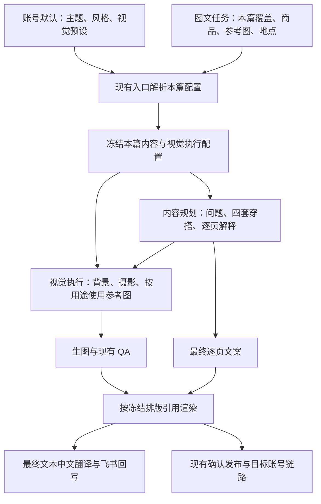

# 图文视觉预设与主题文案闭环修复——开发交接方案

日期：2026-09-15。本文是开发方案，不代表以下修复已经完成。

## 1. 背景、证据与本轮边界

图文模块正在从单一旅行穿搭，扩展为账号默认定位与本篇主题、视觉预设组合驱动的原生图文生产。多数内容将采用纯色或简洁室内背景，部分内容使用目的地场景；背景方式与内容主题独立，例如温度穿搭可以在纯色背景下讲述。

本次基于七条“美国村”记录的代码、任务产物及全部 28 张成片审查。详细证据见同目录 `PHOTO_VISUAL_PRESET_SEVEN_SAMPLE_REVIEW_20260915.md`。已确认：

| 能力 | 当前实际情况 | 本轮处理 |
|---|---|---|
| 账号默认、本篇覆盖、视觉预设选择 | 已有入口和配置 | 延续现有优先级，不新建配置入口 |
| 四页成片、完整中文回写 | 七条均有，中文主要语义对应 | 复用，仅适配新排版的最终文本来源 |
| 固定背景 | 规划正确，纯色与室内样片实际都生成街景 | 修执行链路 |
| 固定背景 QA | 场景豁免可短路商品和人物检查；重试又可能丢失豁免上下文 | 优先修控制流 |
| 原生一衣多穿文案 | 三条回落通用四场合/投票文案，其中两条完全相同 | 修主题路由 |
| 温度主题 | 地点已进入文案，部分标题承诺与内页理由不匹配 | 修内容规划和文案采用方式 |
| 新排版 | 七条仍是 PHOTO_TRAVEL_CARD_V3；structured_v1 只有配置 | 单独完成渲染接线与样片验收 |
| 摄影基准 | 已有配置，未真正消费 | 随背景执行合同接入 |
| 账号风格图片、场景库自动匹配 | 未完成 | 本轮不作为已交付能力；自动场景库后置 |

当前已有专项 102 项通过，仍漏掉上述执行错误，因此不能以测试数量代替端到端验收。审查时工作区存在较多其他模型的未提交修改；实施前记录当前差异，按实际工作区核对，不覆盖、回退或提交他人的变更。

本轮范围为：QA 修复 → 视觉执行接线 → 主题文案接线 → 新排版。继续使用现有生成模型、任务体系、素材与修订机制、飞书字段和发布链路。不要将此任务扩大成内容中台或新一轮模型选型。

## 2. 保持统一的架构



主题回答“讲什么”；视觉预设回答“在哪里、怎样拍、采用哪套版式”；参考图提供对应用途的视觉信息。三者不合并成按账号命名的特殊 Recipe。

逐项优先级保持：本篇明确选择 > 账号默认 > 现有入口默认。继承一个视觉预设，不覆盖本篇已经选择的主题。已冻结任务续跑不重新读取账号最新默认。内部生成 profile 的 account_id 与真实 target_publish_account_id 保持现有区分。

运营继续使用已有下拉框。本文 JSON、版本和渲染字段均为开发内部配置，不要求运营维护。

## 3. Phase 1：修 QA 与实际背景执行

### 3.1 先修固定背景 QA 的控制流

代码落点：

- `services/photo_travel_qa.py`：当前 fixed_background 且 observed_moment 与计划不同的分支。
- `services/photo_reference_vision.py`：首次响应与结构重试的归一化调用。

修改要求：

1. 将“是否需要检查旅行场所”与商品、重大穿搭错误、人物硬缺陷等判断分开。固定背景只跳过不适用的旅行场所规则，不能用成功分支结束后续检查。
2. 保留现有失败码和修复入口；如兼容层只接受一个主失败码，可按现有优先级返回，但计算过程不能漏掉适用的核心检查。
3. 首次和重试复用同一套归一化上下文，至少包含固定背景信息。正常室内不能因不存在 airport/shopping 等旅行 moment 被判失败；模型响应缺字段、不可解析则仍按现有异常路径处理。
4. 鞋履与天气检查依据本篇实际内容和活动，不因固定背景仍携带历史 travel_moment 就强制要求户外证据。
5. 沿用 standard 的尺度和修复次数。此次修漏检和误拦，不提高全局严格度、不增加 QA 阶段。

必要测试：正常固定室内通过；固定室内但商品明显不符失败；固定室内但人物畸形失败；普通旅行场景检查仍生效；首次与重试结果一致。用各缺陷独立样例，避免一个失败遮住其他未执行的检查。

### 3.2 把视觉预设变成真正执行的冻结配置

代码落点：

- `services/visual_preset.py`、`config/visual_presets/*.json`。
- `services/feishu_workflow.py`：预设解析、style_profile 和 request 组装。
- `services/photo_reference_vision.py`：规划提示与现有视觉 QA 上下文。
- `services/photo_style_reference_supply.py`：镜头请求、背景锚点、参考图选择。
- `services/image_generator.py`：实际 presentation_profile 和模型请求消费。
- 必要时仅为 `domain/models.py` 的现有请求对象增加可选字段。

当前 preset_snapshot 只存身份、版本、mode 和指纹，不足以恢复实际执行规则。扩充现有快照，存入规范化后的背景、摄影与排版有效配置，避免下游再次用显示名解析最新文件。

内部配置建议如下；可复用已有字段，不另建同义对象：

```json
{
  "preset_id": "沿用现有逻辑 ID",
  "version": 2,
  "source": "task",
  "background": {
    "mode": "fixed",
    "kind": "solid",
    "fixed_scene_zh": "奶白纯色背景",
    "stability_zh": "本组背景与照明保持统一"
  },
  "photography_baseline_zh": "预设已有摄影说明",
  "layout": {
    "layout_family": "structured_v1",
    "layout_version": 1,
    "page_kinds": ["cover", "detail"]
  },
  "fingerprint": "对有效配置计算"
}
```

`kind` 建议为 `solid / indoor / destination`，用于区分“纯色”和“固定室内”；保留现有 fixed/scene 兼容，不通过中文描述猜类型。上述数值是新契约建议，实际版本按仓库约定命名。

执行规则：

| 有效背景 | 实际生成 | 参考图处理 | 现有 QA 检查 |
|---|---|---|---|
| solid | 进入现有 solid_color 生图分支 | 不注入环境锚点；保留商品、人物、穿搭和摄影用途 | 是否明显跑成场景图，以及适用的核心缺陷 |
| indoor | 固定简洁室内；不能误映射成纯色或旅行街景 | 同上，使用预设室内描述 | 是否明显跑到户外；不检查室内摆件位置 |
| destination | 使用本篇目的地与场景设计 | 环境参考可参与，但不得覆盖明确目的地 | 沿用旅行检查，关注明显跨目的地的冲突 |

具体修复：

1. `photo_style_reference_supply.py` 中 `_with_background_anchor` 的开关不能只依据 travel_moment；背景 mode/kind 是执行依据。
2. 镜头构图和 presentation_profile 读取同一份冻结配置。去掉固定背景路径残留的旅行场所强制提示；地点仍可出现在文案中。
3. 参考图为 ENVIRONMENT 单一用途时，固定背景路径不发送该环境参考；同图同时承担 OUTFIT/VISUAL_STYLE 时保留有效用途并明确不采用背景，不要求运营重新上传拆图。
4. photography_baseline_zh 真正注入生成；在本篇规划时解析账号风格文字与预设的统一色调方向，避免每张各自选择。商品颜色、人物肤色参考优先，不以整体色调改变商品款色。无需 LUT 或精确色温阈值。
5. 单张与组级 QA 同步接收有效背景目标。选择纯色却出现街道属于执行错误；墙面细微明暗、室内道具变化不作为新增拦截项。
6. 固定背景首次验证批次可使用已有首图门禁确认后再扩展剩余图。保留正常生产并行策略；门禁失败后停止尚未提交的同类错误生成，已在途或已生成素材保留，不全局改成串行或无限重试。

历史兼容：新配置版本只用于新任务或明确的新修订。旧快照缺有效配置时，优先读取原冻结 plan/request；不能静默套用现在的默认预设。确实无法恢复时提示创建明确修订，保留旧成片，不自动触发付费重生。不需要新表或批量数据 migration。

验收必须检查最终传给模型的请求参数和参考图用途，再看实际图片；不能只断言规划 prompt 中出现“纯色”。

## 4. Phase 2：让主题决定文案，保留可用图片

代码落点：

- `services/photo_theme.py`：原生 native_multiway 主题定义和展示文案。
- `services/feishu_workflow.py`：主题上下文构建条件。
- `services/photo_reference_vision.py`：有主题时输出文案的规划分支。
- `services/photo_content_planner.py`：topic_linked、model_copy 采用、旧模板 fallback、现有文案修订入口。

### 4.1 原生一衣多穿进入正式文案路径

现状是 native_multiway 已存在，但文案路径只看 travel_theme_type，因而回落旧四选一模板。使用现有主题注册机制补充原生一衣多穿的文案规划能力标识或类型；入口、规划与最终采用读取同一判断，不在三个文件各自添加特殊条件。不要把一衣多穿冒充温度主题，不改 legacy 视频一衣多穿路由。

规划继续使用原有四套搭配，补足叙事：同一件商品为何值得这样搭；每页配套有什么差别；差别适用于什么需求。首张同时承担封面和第一套搭配，不新增重复封面。

示例方向：

- 封面：“去美国村，一件黑色短外套怎么搭出四种感觉？”
- 后续页面依据实际裙裤、鞋履和比例解释变化；不自动编造未出现的配件、商品面料或保暖能力。
- 标题、正文或必要页文案自然体现本篇地点；固定背景不用画出景点，也不要求每页重复地名。
- 有商品编码时围绕已选款色说明“一衣多穿”；自由搭配只有规划确实复用同一核心单品才使用该表述。

显式选择且支持的主题缺少正式文案时，走现有有限修复/任务错误路径，尽量在生图前发现；不能静默用通用投票文案冒充完成。历史无主题任务保留原兼容 fallback。

### 4.2 温度主题：标题承诺由实际内容支撑

在同一次规划/文案生成中要求“标题提出的问题，由实际搭配和正文回答”，不新建打分器。

- 画面主要是裙裤、比例和行走差异，就用“微凉天气逛美国村，裙装和裤装怎么搭”等匹配承诺。
- 若主标题强调温差与穿脱，正文或适当内页需要给出已有画面能支持的内搭、外层使用建议。
- 取消“选裤还是裙更方便脱外套”这类牵强因果关系。
- 不硬性要求每页讲温度，也不凭生成图声称可抵御某个低温或具有未经证实的商品性能。

不要通过重生图片强行满足旧标题。优先根据实际源图修正文案；存在真正视觉错误才单独修图。

### 4.3 文案修订和中文回写

复用现有 adopt_repaired_copy/修订机制。内容源图正确时，只修文案、渲染、中文及 manifest，避免重新规划穿搭或触发全部生图。

当前 CTA 已有从最终页保留的修复，不能为本轮重新退回固定投票口号。新排版用明确 CTA 字段时兼容已有最终页文本，避免末页出现两次 CTA。

必要测试：原生一衣多穿采用模型主题文案而非 copy_templates；显式地点进入最终内容；文案修订不调用生图；历史无主题兼容；温度主题无固定四选一覆盖。两篇同主题允许局部重复表达，不增加随机改写或“查重不过就重生”的新门禁。

## 5. Phase 3：完成已有 structured_v1 排版承诺

代码落点：`services/photo_package.py`、现有模板配置/注册位置、`services/photo_theme.py`、`services/photo_content_planner.py`、`services/copy_translation.py`、`services/feishu_workflow.py`。

若当前 exporter 过大，可新增一个薄的结构化排版辅助模块；仍由原 export 入口调用，不新建第二条打包发布链路。

### 5.1 本轮只交付一套结构化排版族

背景不同不意味着必须做三套独立排版器。复用一套 cover/detail 层级，采用少量文本区域变体：

| 页面 | 内容层级 | 布局与构图指导 |
|---|---|---|
| 首张/第一套搭配 | 主标题；可选短副标题 | 主体清晰，文字在空白侧或下方；不重复增加一张无信息封面 |
| 后三张 | 短标题＋一条实际搭配理由 | 同组字体、字号层级、对齐方式稳定；理由正常换行，避免细长标签 |
| 最后一张 | 搭配说明＋可选轻 CTA | CTA 次级呈现；不再强制深色底条或四选一口号 |

具体实现：

1. 在本篇规划中确定主体侧与文字区，传给生图和渲染；提供左/右留白或下方文字区几个确定性选项即可。沿用已有尺寸，不加新画幅体系。
2. 奶白/深灰等少量文字配色由预设解析。同组不逐页任意换风格；必要时用局部浅遮罩或底色保证可读，不强制整块居中卡片。
3. 泰文使用现有可用字体及测量能力，支持合理断行与声调字形边界。溢出先换行、调整文本区域；不要无限缩字号或静默裁掉正文。
4. 既有图片未给足留白时可采用不遮主体的文字区或边栏版式，优先重排；不要为版式验证默认重生全部图片。
5. layout_family 必须解析到真实渲染实现。显式选择尚未支持的新版 layout 时清楚报错，不静默用 PHOTO_TRAVEL_CARD_V3 并在摘要显示“新版”。

以上是模板执行规则，不新增审美得分门禁。沿用现有成片文字 QA 识别不可读、截断等问题，不要求视觉模型精确判断每个坐标。

### 5.2 最终文字保持单一来源

如果引入结构化 pages，最小字段可为 page_kind、对应 asset 引用、headline、body、cta 和文本区域。字段应沿用现有含义，避免同时维护多份可编辑文案。

渲染前完成最终文本归一化，从同一份数据生成实际绘制文本及兼容 slide_texts；中文翻译、最终 QA 与 manifest 使用这份文本。不要先翻译早期 plan，再由 renderer 偷偷追加文字。

中文列继续逐页呈现实际成片的标题、解释、CTA，另包含发布标题、正文、标签。复用 copy_translation 缓存与指纹，文案变化自动失效；纯布局变化且文字完全不变可复用翻译。

manifest 记录实际 renderer/layout 版本和文案指纹；原图、最终页顺序、附件与中文页序保持一致。

### 5.3 与旧流程和穿搭拆解兼容

新排版只对明确绑定新 layout 的任务启用。旧模板、围巾、MX 假发以及已有拆解 board 路由保持兼容。本轮四页每页一张主图是该排版的能力，不是全系统限制；不要在公共模型中写死“一页只允许一个素材”，避免影响未来主图＋单品拆解布局。

背景、摄影属于素材生成；多素材组合属于现有版式/board 能力。纯色背景不自动等于平铺拆解，也不在本轮整合拆解渲染器。

## 6. 样片复用与最低成本验证

先离线测试和旧图重排，再少量新生图。保留七行原始产物与修订记录，不一次性全部重跑。

| 现有记录 | 建议处理 |
|---|---|
| recvvh9mY8cjn9 | 用旧图验证文案、排版；要验收纯色背景，必须新修订生图 |
| recvvh9mY8wQ1e | 修一衣多穿文案；要验收固定室内，必须新修订生图 |
| recvvh9mY83Tbl | 优先复用源图修一衣多穿文案与新排版 |
| recvvh9mY89ucT | 修文案；首图异地建筑氛围明显，作为美国村成片使用前需替换/修复该页 |
| recvvh9mY8GOcw | 修标题与理由、新排版；末页场景氛围偏离，需处理后再作为目的地样例 |
| recvvh9mY8Hcj7 | 优先复用源图作温度文案和新排版样例 |
| recvvh9mY8wKps | 修标题因果关系和页面理由，源图无新增问题则复用 |

新生图只需一个小验证组：同一商品编码、同一已选款色，使用纯色、简洁室内、旅行场景三种视觉预设。主对照固定同一主题与参考来源，另用上述可复用记录验证另一主题。避免同时变更商品与背景后声称是背景对照。

每组核对：入口实际选择 → 冻结配置 → 模型请求 → 实际图片 → 最终文字与中文。首张就是第一套，不重复封面；固定背景不出现街景；目的地场景不明显跨到另一种城市标志。

不要求复刻真实景点每个细节；明确景点信息不足时采用不冒认地标的当地街区环境。场景库、联网找景点、自动参考图组合后置。

## 7. 测试与交付要求

### 自动验证

扩展现有 `test_photo_travel_semantics`、`test_copy_and_visual_preset`、`test_photo_reference_vision`、`test_travel_topic_linkage`、`test_photo_content_planner`、`test_photo_package` 等相应测试，覆盖：

1. 固定背景不误拦、关键缺陷不漏检、重试上下文一致。
2. solid/indoor/destination 在实际请求层分流；固定背景不重新注入环境锚点，多用途参考的穿搭用途保留。
3. 账号默认、本篇覆盖、冻结续跑；修改当前配置后旧任务执行配置不漂移。
4. 一衣多穿正式文案接通；文案修订不重生图片。
5. 新 renderer 被实际调用，四页顺序正确，首图不重复，CTA 不重复，泰文不截断，中文源与最终绘制文本一致。
6. 公共模块改动相关的 VN 围巾、MX 假发、旧模板/board、目标账号传递回归。测试不应真实生成或发布。

以现有仓库测试约定运行受影响测试及必要回归。若基线已有失败，记录实际用例、失败原因与本轮差异，不能仅归为“其他模型正在修改”。不要靠放宽断言让错误背景通过。

### 交付材料

- 代码差异与对应测试结果。
- 新旧排版同源图对照。
- 三种背景少量样片，以及实际 preset/layout 版本、文案来源和 QA 结论。
- 飞书中文与最终页面对应的核对结果。
- 实际重用/新生图片数量，剩余未完成项。

## 8. 部署与范围控制

建议分三个开发交付批次：

1. Phase 1 单独合并：QA 控制流与背景执行闭环，先通过离线回归和固定背景小样。
2. Phase 2 单独合并：主题文案路由，使用旧图验证，不等待新排版才修一衣多穿。
3. Phase 3 单独合并：新版渲染，完成同源图对照，再做三种背景综合验收。

新视觉快照和 renderer 版本仅作用于明确启用的新任务/修订。若新版失败，停止该版本新任务并修复；历史素材和任务保留。不要将错误背景静默回退成旅行图后标完成。

本轮不新增飞书必填字段、不新增账号人工审核、不调整发布账号分配、不重做翻译、不加新模型、不建立场景库或审美评分系统。账号风格图片尚未消费这一限制应保留在交付说明中；现阶段使用已接入的文字风格及明确用途的任务参考图。若后续接账号风格图片，仍进入同一个参考用途解析入口，不另起专属生图路径。

满足“实际背景正确、主题文案正确、新排版实际执行、中文对应、旧链路回归”后，再扩大使用新方案。此前已有旅行生产能力可独立使用，但不能将本批七条统一视为新版视觉方案验收通过。
