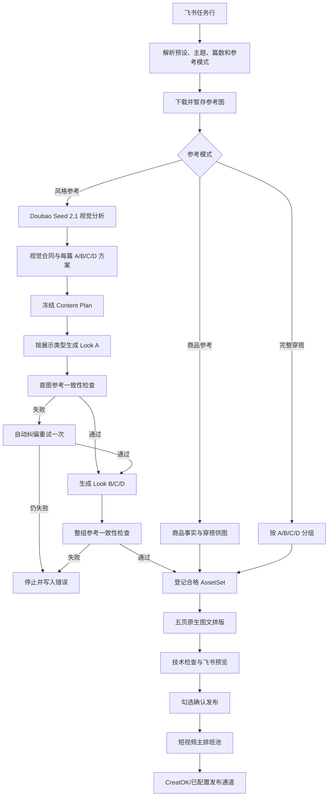

# TH 图文参考理解与生产模块交接文档

更新日期：2026-09-07
当前范围：TH 女装原生图文，优先跑通“穿搭四选一”
当前 Recipe：`PHOTO_TH_PICK_YOUR_LOOK_V3`，正式版本 V9

## 1. 交接结论

本模块已经从“用本地像素特征猜参考图类型，再套固定穿搭族”改为：

1. 使用 Doubao Seed 2.1 理解参考图的展示方式、风格、场景、配色和服装语言；
2. 同一次分析生成每篇 A/B/C/D 的具体穿搭方案和泰语文案；
3. 冻结内容计划后再调用现有生图能力；
4. 真人场景、纯背景真人和平铺分别路由；
5. 首张 Look A 做独立视觉检查，失败自动修正一次；
6. 四张素材完成后做整组参考一致性检查；
7. 通过原生多图链生成五页图文，进入现有主排班和发布系统。

旧穿搭图文和图文视频路径仍然保留。V9 只扩展当前 TH 原生图文流程，没有原地替换历史 Recipe、冻结任务或发布记录。

当前自动化测试为 `595/595` 通过（589 基线 + 6 项整组失败续跑测试，2026-09-07）。两张历史参考图的真实模型验证已经把原来的错误 `FLAT_LAY` 判断纠正为 `SCENE_MODEL`，置信度 0.90，并正确提取法式复古、咖啡馆街景和卡其/奶油/酒红/深靛蓝等视觉信息。

## 2. 业务边界

当前已完成并验证：

- TH 女装；
- 原生多图；
- 四选一 Recipe；
- 商品参考、风格参考、完整穿搭三种输入模式；
- 单行生成 1–9 篇的基础批量能力；
- 内容方案冻结、素材生成、排版、技术检查和主发布队列衔接；
- 风格参考图的语义理解和参考一致性检查。

当前没有作为本阶段交付目标：

- 账号初始流量测试和 A/B/C/D 账号评分；
- MX 假发正式生产；
- 自动判断 Stable/Explore 比例；
- 实时天气；
- 完整内容中台；
- 将所有旧 Recipe 改成视觉合同驱动。

仓库中虽然已有 MX、温度穿搭、旅行穿搭等配置文件，但不能据此认定它们已经通过真实生产验收。当前应先稳定 TH 四选一。

## 3. 操作入口

正式运营入口是飞书图文任务表。默认参数在：

- wiki token：由 `scripts/run_feishu_tasks.py` 默认参数维护；
- table id：由同一脚本默认参数维护；
- 表结构安装脚本：`scripts/ensure_feishu_task_table.py`。

正式扫描器每 120 秒读取当前代码，入口为：

```bash
scripts/run_feishu_scanner_locked.sh
```

开发和定点测试应限制到单条记录：

```bash
python3 scripts/run_feishu_tasks.py --record-id <飞书 record_id>
```

只读检查：

```bash
python3 scripts/run_feishu_tasks.py --record-id <飞书 record_id> --dry-run
```

不要在生产环境测试时省略 `--record-id`，否则会扫描所有满足状态条件的记录。

## 4. 运营人员需要维护的字段

| 字段 | 是否必填 | 用途 |
|---|---:|---|
| `生产预设` | 是 | 当前选择“图文｜TH｜穿搭四选一” |
| `生成篇数` | 是 | 1–9 |
| `图文主题` | 风格参考时必填 | 秋季穿搭、凉爽旅行、日常通勤、咖啡约会 |
| `参考图类型` | 有参考图时必填 | 商品参考、风格参考、完整穿搭或自动判断 |
| `参考图（可选）` | 视模式 | 上传商品图、风格参考图或完整穿搭 |
| `产品编码` | 商品参考可用 | 已存在商品资料时替代上传商品图 |
| `内容要求（可选）` | 否 | 例如“法系复古氛围感风格穿搭” |
| `执行` | 是 | 勾选后进入生产 |
| `确认发布` | 发布时 | 成品确认后进入主排班 |

系统输出字段：

- `内容方案摘要`：展示冻结后的每篇内容角度、配色和 A/B/C/D；
- `素材状态`：记录素材准备状态；
- `进度`、`审核阶段`、`备注`：展示流程状态和失败原因；
- `预览/成片`：最终五页图文附件。

运营不应维护 Recipe JSON、Prompt JSON、AssetSet ID、图片角色、哈希或模型参数。`内容方案摘要` 是输出，不应再被当成人工 Prompt 输入。

## 5. 三种参考模式

### 5.1 风格参考

建议上传 1–3 张能够清楚表达目标审美的图片。优先使用：

- 完整人物或完整穿搭可见；
- 场景、季节、配色和服装语言明确；
- 图片之间属于同一审美方向；
- 没有大面积水印、Logo、商品编号或截图界面；
- 若希望生活场景成片，应提供真人生活场景参考；
- 若希望平铺成片，应提供真正的服装平铺参考。

参考图不是待发布素材，也不是只能使用一次的图片。它用于建立“视觉合同”，系统据此规划和生成新素材。当前合同按飞书记录冻结；同一记录修改参考图、主题、内容要求或篇数会被拒绝，避免新旧计划混用。需要改变输入时应新建记录。

### 5.2 商品参考

上传 1–3 张同一商品的清晰图片，或填写产品编码。系统保持目标商品事实，规划不同内搭、下装和鞋履。该路径继续复用现有商品事实和穿搭供图能力，目前没有改成 Doubao 语义合同。

### 5.3 完整穿搭

适用于已经拥有可直接排版的完整素材。每篇四张，顺序为 A/B/C/D；三篇需要十二张。系统不会重新生图，只生成排版和文案。

## 6. 系统数据流



## 7. 视觉合同

实现文件：`services/photo_reference_vision.py`。

视觉分析输出至少包含：

- `presentation_type`：`FLAT_LAY`、`MODEL_FULL_BODY`、`SCENE_MODEL`；
- 每张参考图的用途和展示方式；
- 聚合风格、季节、配色、材质、场景、构图、光线和禁用项；
- 置信度，低于 0.65 直接停止；
- 与生成篇数一致的 `recommended_sets`；
- 每篇有顺序固定的 `look_a` 至 `look_d`；
- 每套 Look 有外套、内搭、下装、鞋履和泰语标签；
- 每篇有泰语标题、封面、正文和 CTA。

合同缓存在：

```text
~/.openclaw/shared/data/organic_photo_video/reference_contracts/<record_id>/contract.json
```

缓存使用原始参考图哈希、主题、类目、内容要求、篇数、模型和 Prompt 版本作为输入指纹。模型使用的压缩图缓存在 `_model_inputs`，原图仍是哈希事实来源。

## 8. 模型配置

视觉线路使用：

- 模型：`Doubao-Seed-2.1-turbo`；
- Base URL：`https://ark.cn-beijing.volces.com/api/coding/v3`；
- API：OpenAI 兼容的 `/chat/completions`；
- 深度推理：关闭；
- 返回格式：JSON object；
- 单张最长边：1600 px；
- JPEG quality：86；
- 超时：90 秒。

本机配置文件为工作区根目录 `.env.local`，权限应为 `0600`，并已被 `.gitignore` 排除。只使用以下变量：

```text
OPV_PHOTO_VISION_MODEL
OPV_PHOTO_VISION_API_URL
OPV_PHOTO_VISION_API_KEY
```

不要把 API Key 写入代码、测试快照、日志、文档、提交记录或飞书字段。

服务只从 `.env.local` 加载这三个白名单变量，并且不会覆盖进程已经设置的同名环境变量。

### 8.1 生图通道（2026-09-07 起默认 CreatOK，codex 兜底）

成片/供给图生成通道改为 `services/image_generator.py::build_default_photo_generator()`：

- **主通道**：`CreatokImageGenerator` —— 通过 `creatok` CLI（`image generate`）调 CreatOK，默认 `gpt-image-2-official` / `1K` / `quality=low` / `9:16`；CLI 只回 envelope 和 `result.json`，图片由适配器从返回 URL 下载。鉴权依赖 `CREATOK_API_KEY`（工作区根 `.env` 已配置，入口脚本 `load_repo_env()` 会带上）。
- **兜底通道**：`OpenAIImageGenerator`（`skills/openai-image`，codex OAuth）。主通道任何失败（缺 key、CLI 报错、超时、下载失败、9:16 QC 不过）自动落到兜底，`outcome.raw.channel=fallback` + `primary_error` 可追溯。
- 计费注意：gpt-image-2-official 按 quality 分档，1K 下 low=1 / medium=2 / high=8 credits/张，参考图每 2 张加 1 credit。批量一篇约 24-30 张（low 档约 24-30 credits/篇）。
- 开关（env，均有默认）：
  - `OPV_PHOTO_CHANNEL`：`creatok_fallback`（默认）｜`creatok`（无兜底）｜`openai-image`（回旧通道）；
  - `OPV_CREATOK_IMAGE_MODEL` / `_RESOLUTION` / `_QUALITY`（置空表示不传 quality）/ `_ASPECT_RATIO` / `_BIN` / `_POLL_TIMEOUT`。
- 2026-09-07 已实测：CLI envelope、1K 9:16 输出 1088x1920（过 `check_portrait_916`）、适配器端到端冒烟、13 项单测；全量 631/631。

## 9. 规划与生成规则

实现文件：

- `services/photo_content_planner.py`
- `services/photo_style_reference_supply.py`
- `services/image_generator.py`
- `services/photo_theme.py`

风格参考模式且合同来自 Doubao 时，规划器直接消费 `recommended_sets`，不再映射旧固定 family。计划保存：

- 内容角度；
- 场景；
- 配色；
- 背景 Prompt；
- 展示方式；
- A/B/C/D 具体单品；
- 泰语标题、封面、正文和 CTA；
- 用于跨篇去重的 Look 签名。

展示路由：

| 类型 | 人物模板 | 背景模式 | 生成要求 |
|---|---:|---|---|
| `FLAT_LAY` | 不需要 | `reference_surface` | 正上方平铺，禁止人物、人台、衣架 |
| `MODEL_FULL_BODY` | 需要 | `solid_color` | 完整真人、简单纯色背景 |
| `SCENE_MODEL` | 需要 | `creator_environment` | 完整真人、保留生活场景语义 |

真人模式依赖图文生产账号绑定 `persona_ref_id`。缺人物模板会在生图前停止。

标题规则：风格参考 V9 使用视觉合同中每篇的 `copy.title`；封面使用 `copy.cover`；发布正文使用 `copy.caption`。商品参考、完整穿搭和旧冻结任务仍可能使用主题或固定 Recipe 文案，这是保留的兼容行为。

## 10. 不可变与幂等规则

- Content Plan 在第一次付费生图前冻结；
- 同一记录改变主题、参考模式、参考图、内容要求或篇数时拒绝续跑；
- 已生成图片按角色、文件哈希和计划签名写入供图 manifest；
- 重试会读取已完成角色，避免重复生成；
- Recipe 更新不能修改旧冻结任务的 Recipe snapshot；
- 历史 V1/V2 和旧图文视频任务继续按原 snapshot 续跑；
- 不要通过删除数据库记录或覆盖历史 manifest 来“修复”旧任务。

内容计划目录：

```text
~/.openclaw/shared/data/organic_photo_video/content_plans/<record_id>/plan.json
```

风格供图目录：

```text
~/.openclaw/shared/data/organic_photo_video/style_reference_supply/<record_id>_item_<n>/
```

## 11. 核心文件索引

| 文件 | 职责 |
|---|---|
| `services/feishu_workflow.py` | 飞书字段解析、参考模式路由、计划冻结、生产与状态回写 |
| `services/photo_reference_vision.py` | Doubao 视觉理解、合同缓存、首图/整组一致性检查 |
| `services/photo_content_planner.py` | 生成并验证批次内容计划 |
| `services/photo_style_reference_supply.py` | 按计划生成 A/B/C/D，首图重试和整组检查 |
| `services/image_generator.py` | 生图 Prompt 合同与场景/平铺/真人路由 |
| `services/photo_theme.py` | 可选主题、泰语文案组合和冻结 Look 兼容逻辑 |
| `services/photo_reference.py` | 参考图类型解析 |
| `services/photo_asset_supply.py` | 参考图暂存和合格 AssetSet 登记 |
| `services/photo_content_check.py` | 单篇及跨篇素材重复检查 |
| `config/recipes/PHOTO_TH_PICK_YOUR_LOOK_V3.json` | V9 Recipe |
| `config/photo_planning_policies/TH_PICK_YOUR_LOOK_V2.json` | 旧 family 兼容规则和展示路由 |
| `scripts/ensure_feishu_task_table.py` | 幂等同步飞书字段 |
| `scripts/deploy_th_photo_planner.py` | 只部署 TH 四选一 Recipe，不写飞书 |
| `scripts/run_feishu_tasks.py` | 生产扫描入口 |
| `scripts/run_publish_scheduler.py` | 旧独立排班故障入口；正式发布已走主排班 |

## 12. 测试

全量测试：

```bash
cd /Users/likeu3/.openclaw/workspace/packages/organic_photo_video
PYTHONPATH=.:tests python3 -m unittest discover -s tests
```

当前期望：

```text
Ran 595 tests
OK
```

本模块重点测试：

```bash
PYTHONPATH=.:tests python3 -m unittest \
  tests.test_photo_reference_vision \
  tests.test_photo_content_planner \
  tests.test_photo_theme_reference \
  tests.test_photo_feishu_batch
```

测试覆盖：

- `SCENE_MODEL` 语义合同；
- 低置信度拒绝；
- 必要维度低于 75 时视觉检查失败；
- 多篇动态规划和跨篇去重；
- 首图失败后自动重试；
- 整组视觉复核；
- 整组失败按角色失效、有限重做与 QA 证据保留；
- 平铺模式不使用人物模板；
- 历史本地 style profile 兼容；
- 飞书多篇冻结和五页输出。

真实模型测试不要写 API Key。直接实例化 `PhotoReferenceVisionService`，让它从本机环境读取配置。真实调用会产生模型费用，必须使用明确指定的测试记录和参考图。

## 13. 正式配置检查

飞书字段只读检查：

```bash
python3 scripts/ensure_feishu_task_table.py --dry-run
```

正式表当前应包含 `内容要求（可选）`。

Recipe 只读检查：

```bash
python3 scripts/deploy_th_photo_planner.py
```

当前应显示：

```text
current_version: 9
target_version: 9
already_matches: true
action: unchanged
```

只有本地测试通过并明确需要更新正式配置时，才执行：

```bash
python3 scripts/deploy_th_photo_planner.py --apply
```

该脚本只更新 RDS 中 `PHOTO_TH_PICK_YOUR_LOOK_V3`，不会生成任务或写飞书。

## 14. 建议的人工验收标准

一次正式样本应逐项检查：

1. 参考图是人物场景时，结果不能变成服装平铺或纯色棚拍；
2. 场景、风格、配色和服装语言必须在成片中肉眼可见；
3. A/B/C/D 都是完整穿搭，不能只有外套颜色轻微变化；
4. 四套的外套、下装或整体轮廓应有明确差异；
5. 同一篇人物身份、年龄感和视觉质感保持稳定；
6. 不复制参考图人物身份、Logo、水印或来源文字；
7. 五页顺序正确：四宫格封面、A、B、C、D+CTA；
8. 图片中没有乱码和模型生成文字；
9. 泰语标题、封面和正文属于同一个内容角度；
10. 飞书摘要与实际 A/B/C/D 一致；
11. 点击确认发布后只进入一次主排班；
12. CreatOK 最终收到原生多图，而不是拼接图文视频。

技术通过不等于审美通过。测试报告应分别记录：技术合同、内容质量、泰语质量和最终发布结果。

## 15. 已知限制和下一步优先级

### P0：真实端到端样本（2026-09-07 技术链路已跑通）

新建一条飞书记录，只生成 1 篇，使用已确认的人物场景参考图，完成：

```text
视觉合同 → 四套供图 → 五页排版 → 飞书附件 → 主排班预检
```

已执行：记录 `recvuuxATOACC2`（1 篇 SCENE_MODEL，参考图复用 recvurZsAHS6sF 的两张历史验证图）。
技术结果：合同 SCENE_MODEL 置信度 0.9；整组 QA 90-95 通过；RDS 单任务 `opv_task_20260907_3ffa091a9920`（photo_packaging）单 revision 单 package，slide/shot 资产全部指向包内副本且哈希匹配；发布记录 0；飞书五页附件与内容方案摘要一致；五页逐页目检通过（真人场景保持、P2-P5=A/B/C/D 标注正确、泰语清晰无乱码）。
剩余：人工审美验收后决定是否勾选确认发布（发布即进主排班，CreatOK 原生多图）。

⚠️ 本次暴露的并发风险：手动裸跑 `python3 scripts/run_feishu_tasks.py --record-id ...` 不会持有扫描器锁，会与 crontab 每 2 分钟的 `run_feishu_scanner_locked.sh` 并发处理同一记录（本记录被完整生产了两遍，源图被第二遍覆盖，靠包内副本保住了发布链路）。定点测试必须通过 `run_feishu_scanner_locked.sh` 执行（内部带锁），或先临时注释 crontab。`recvuuxATOACC2` 的 supply manifest lineage（第二遍）与 RDS package lineage（第一遍副本）不一致，审计时注意；旧 asset set `ASSET_TH_WOMENSWEAR_UPLOAD_a396e727896df75a` 引用已覆盖文件，勿再引用。

### P0：修复整组失败后的恢复语义（2026-09-07 已完成）

旧缺口：整组视觉检查失败时，四张已生成图片仍保存在 `incomplete` manifest，直接续跑会对同一组图片再次检查并再次失败，无法自愈。

当前实现（`services/photo_style_reference_supply.py` + `services/photo_reference_vision.py`）：

- 整组检查 Prompt 额外返回 `per_look` 逐张归因，归一化为 `role_findings`（无法归因或结构无效时返回空列表）；
- `role_findings` 中 `passed=false` 的角色被移出生效 sources，写入 `attempt_history` 对应轮次的 `retired`（含旧文件路径、sha256 和当轮完整 alignment 证据），旧文件保留在磁盘；
- 无逐张归因（如整组风格不统一）时显式整组重做，避免在同一组图片上重复检查；
- 重做角色的生图 `shot_version` 随修复轮次递增，不覆盖旧证据文件；
- 修复轮次上限 `MAX_GROUP_REPAIR_ATTEMPTS = 2`，用尽后 manifest 状态置 `group_failed` 并终止；`group_failed` 续跑直接失败，不再调用视觉模型；
- `complete` 状态的 manifest 续跑直接复用缓存结果，不重复整组视觉检查；
- 生图中断在修复轮中时（状态 `group_repair_pending`），续跑只重生成被作废的角色。

新增测试：按角色重做且保留证据、无归因整组重做、达到上限终止且续跑快速失败、中断后只重做失效角色、complete 幂等续跑、`per_look` 归一化。全量 `595/595` 通过。

### P1：批量压力测试

真实验证目前只覆盖 `count=1`。需要依次测试：

- `count=3`：合同完整性、差异度、耗时和费用；
- `count=9`：输出 token 上限、JSON 完整性、超时和规划质量；
- 模型少返回一篇、少返回一个 Look 或返回重复 Look 时的拒绝行为。

不要直接用九篇作为第一次生产测试。

### P1：精简视觉复核输入

目前视觉复核 Prompt 会携带较完整合同。可改为只传展示方式、场景、风格、配色、禁用项和当前 Look，从而降低 token、延迟和成本。必须保持原图与生成图直接对照，不能只检查结构化合同。

### P1：泰语文案质量

视觉模型会输出泰语标题和标签，但目前只有结构检查，没有独立泰语母语质量检查。可增加低成本文案 QA，重点检查自然度、长度、A/B/C/D 标签和标题/正文一致性。

### P2：其他 TH Recipe（旅行穿搭 V2 已于 2026-09-07 接入）

温度穿搭、旅行穿搭和小个子穿搭应复用视觉合同、供图和 QA 层，但需要各自的 Recipe 变量与页面结构。不要只把“四选一”的标题换成温度文案。

旅行穿搭 V2（`PHOTO_TH_TRAVEL_OUTFIT_V2`）已完成接入：

- 规划策略注册表：`services/photo_content_planner.py` 的 `RECIPE_POLICY_FILES`（recipe_id → policy 文件）。新增预设 = 注册 policy + 新 Recipe JSON + copy pack + 预设条目，workflow 不再硬编码 recipe_id；
- 旅行策略：`config/photo_planning_policies/TH_TRAVEL_OUTFIT_V1.json`（8 个旅行场景族：机场转场/老城漫步/咖啡巡礼/夜市/古城拍照/海边散步/山间清晨/商场购物，每族 4 套完整 Look + 泰语文案），仅支持 STYLE 和 COMPLETE_LOOK，PRODUCT 待 outfit_supply 设计；
- 旅行 Recipe：`PHOTO_TH_TRAVEL_OUTFIT_V2`（结构同四选一 V3：四宫格+A/B/C/D+CTA，共享 `TH_WOMENSWEAR_CHOICE` 素材库键），copy pack `TH_TRAVEL_OUTFIT_V2.tsv` 标记 `pending_native_review`（泰语为机器起草，发布前需人工母语审校）；
- 部署：`scripts/deploy_th_photo_planner.py --recipe PHOTO_TH_TRAVEL_OUTFIT_V2 --apply`（脚本已参数化，默认仍是 V3）；
- 注意：preflight 对 V2 报 `NEEDS_ASSET` 属预期（config 级还没有 travel 标签的素材集，首次生产运行会登记合格素材集）。

### 旅行穿搭语义闭环（2026-09-07 第二轮完成）

目标：每张图片、页面标题和旅行场景严格对应，错位可自动发现并定向修复。

- **两步视觉**：`analyze_reference()` 只描述参考图（服装/人物/色调/材质），不决定场景；`plan_travel_content()` 按 Recipe 的 `travel_contract`（场景枚举+审核泰语标签）规划 A/B/C/D，每套带独立 `travel_moment`/`scene_prompt`/`weather_logic`。结构校验失败自动修订一次，仍失败停止生图。泰语标签强制取枚举文案，模型不得自写。
- **按 Look 独立场景生图**：supply 为每个 Look 使用自己的 scene_prompt 与运镜提示（机场/老城/咖啡/傍晚各有专属提示），共同约束（同一人物身份、同一目的地视觉体系、统一色彩基调）写入 style_direction；取消四图同背景的隐含约束。
- **逐页语义质检 `TravelSemanticQA`**（`services/photo_travel_qa.py` + `PhotoReferenceVisionService.review_travel_pages`）：逐页检查场景证据/穿搭/泰语标题/时段光线/文字质量 + 四页风格统一。确定性覆写：observed≠expected 必判 SCENE_MISMATCH；四页同场景必全组失败（回归案例已锚定测试）。失败只重生被归因角色，修复指令（如“当前是咖啡馆，目标是机场，加入航站楼和行李箱”）写入重生成 purpose，且永不重复叠加。
- **泰语门槛**：copy pack 改为审核模板+变量填充（`{destination}`/`{temperature}` 在计划冻结和请求冻结两处填充），状态 DRAFT→(MODEL_CHECKED)→NATIVE_APPROVED；旅行任务勾选确认发布时强制要求模板全部 NATIVE_APPROVED，否则拒绝入队。
- **进度与成本可见性**：新增 规划中/准备素材/素材生成 k/N/质检中/待修复/失败可重试 进度链（生成前先写"准备素材"再开始付费调用）；失败时若已有付费进度则标"失败可重试"并注明断点续跑不重复计费。断点续跑复用已有 manifest 只补缺失角色（既有能力）。
- Recipe 版本 v3（v2 版本号与退役 V1 冲突，key 唯一约束要求升到 3）；旅行 policy v2 加 `planning_flow: travel_two_step`。
- 已知偏离：ProductionBatch 仍按原时序在请求冻结时创建（前置创建需 manifest schema v2 迁移，避免破坏旧冻结批次）；进度链+manifest 幂等+扫描锁已达成同等验收目标。

温度穿搭 V2 需要 `layering_progression` + `layering_roles` 分层证据链；小个子 V2 需要扩展 `required_pairs` 支持 `same_identity_styling_comparison` 关系和 split_vertical 封面——这两项是下一批接入的主要工程量。

### P2：MX 假发

MX 假发可以复用任务、视觉合同、Asset、发布和 Performance 基础设施，但必须新增假发专用属性：发长、卷度、发色、发际线、脸型、Before/After 身份连续性。不要强行复用女装的外套/内搭/下装/鞋履合同。

## 16. 常见问题排查

### 模型调用超时

先检查：

- 是否走 `_DoubaoVisionClient`；
- 是否关闭 thinking；
- 是否使用 `_model_images()` 压缩图；
- 压缩文件是否在数百 KB 级别；
- Base URL 是否只配置到 `/api/coding/v3`，客户端会追加 `/chat/completions`。

不要重新切回 `creator-crm` 的通用 `LLMClient` 多图方法。该方法曾因默认深度推理和大图输入导致两次 120 秒超时。

### 真人参考被判断成平铺

检查 `contract.json` 的：

- `analysis_method` 必须是 `doubao_seed_2_1`；
- `presentation_type`；
- `per_reference`；
- `aggregate.confidence`。

不要恢复 `photo_style_reference_analyzer.py` 中依据肤色像素占比判断展示方式的旧逻辑。该文件只用于历史 profile 兼容。

### 修改飞书后提示输入变化

这是冻结保护。新建飞书任务，不要删除 manifest 或修改 RDS snapshot 绕过。

### 真人模式提示缺人物模板

检查预设绑定的生产账号和 `persona_ref_id`。`FLAT_LAY` 不需要人物模板，`MODEL_FULL_BODY` 和 `SCENE_MODEL` 需要。

### 生成结果有图但飞书没有附件

分别检查：

- `style_reference_supply` manifest；
- ProductionBatch manifest；
- 最终 photo package 路径；
- 飞书上传返回 token；
- `pending_fields_json` 是否等待投影重试。

不要仅凭本地存在图片就判断任务闭环成功。

## 17. 接手开发规则

1. 当前机器连接正式飞书和正式 RDS，写入前先明确影响范围；
2. 所有生产测试限定 `record_id`，且必须通过 `scripts/run_feishu_scanner_locked.sh` 执行（持锁），禁止裸跑 `run_feishu_tasks.py`（2026-09-07 曾因此与定时扫描器并发，同记录双倍生产）；
3. 不覆盖旧冻结任务、Recipe snapshot 或已发布记录；
4. 不删除失败证据来让状态变绿；
5. 修改 Recipe 必须升版本；
6. 新增字段通过幂等 schema 脚本，运营不维护 JSON；
7. 参考图原件、压缩模型输入、视觉合同、计划、生成图和 QA 证据必须可追溯；
8. 先跑聚焦测试，再跑全部测试；
9. 全量测试通过后再执行正式配置写入；
10. 发布相关改动必须验证 Post → Account → Recipe → Asset/Plan 的关联没有丢失；
11. 保留旧 V1/V2 和旧图文视频路径，除非已有单独迁移与下线方案；
12. 工作区当前存在大量未提交历史改动，提交前必须只选择本轮相关文件，不能执行破坏性 reset 或批量覆盖。

## 18. 建议给接手模型的首个任务

> 阅读本交接文档和根目录 AGENTS.md。只处理 TH 原生图文风格参考链。先运行四组聚焦测试和全量测试，确认基线 589 项通过。随后审查 `PhotoStyleReferenceSupplyService` 在 `FULL_LOOK_GROUP` 失败后的续跑行为，设计并实现按角色失效、有限重做和 QA 证据保留。新增失败续跑测试，不修改旧冻结任务，不触发全表扫描，不发布内容。完成后用一条新飞书记录跑 1 篇 `SCENE_MODEL` 样本，并分别报告视觉合同、四张源图、五页成片、飞书投影和主排班预检结果。
