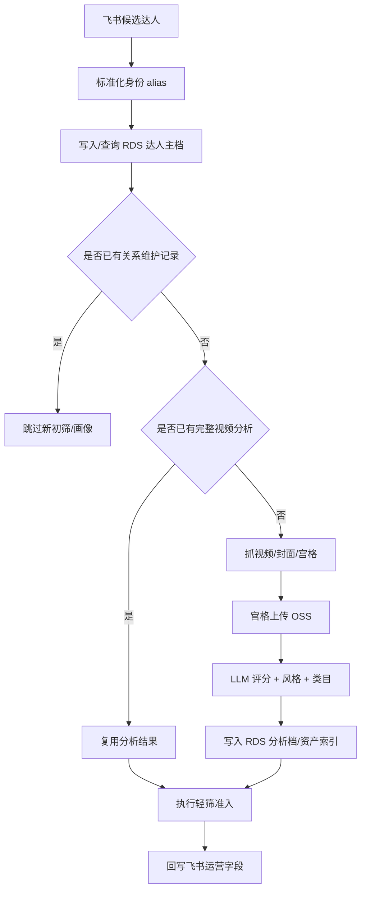

# Creator CRM 长期达人池

## 目标

把 Creator CRM 从“飞书单表任务流”升级为“RDS 长期达人资产池”：

- 新榜单导入后，先查 RDS 全局达人池，再决定是否抓视频/LLM 打标。
- 已经完成视频分析的达人，复用 `视频最终评分 / 风格标签 / 主大类 / 主子类`。
- 已经进入关系维护的达人，默认不再重复进入新达人初筛或完整画像。
- 视频封面宫格等过程资产可直接上传 OSS，飞书不再保留过程附件。
- 飞书继续做任务入口和运营看板，RDS 作为长期主库。

## 表结构

默认表名前缀为 `creator_crm_`，可用 `CREATOR_CRM_TABLE_PREFIX` 覆盖。

- `creator_crm_creator_profiles`：达人主档，存 handle、TikTok URL、Kalodata URL、国家、来源。
- `creator_crm_creator_aliases`：达人唯一身份索引，存 TikTok creator_id、Kalodata creator_id、handle、来源 record id。
- `creator_crm_creator_analysis`：视频分析结果，存评分、评分原因、风格、类目、截图引用、样本视频引用、分析版本。
- `creator_crm_creator_relationship`：关系状态，存关系阶段、当前动作、最近触达/回复、负责人、批次和计划产品。
- `creator_crm_creator_contact_events`：触达/回复/跟进事件流水。
- `creator_crm_creator_source_map`：飞书 app/table/record 到 RDS creator_uid 的映射。
- `creator_crm_creator_assets`：OSS 过程资产索引，存宫格图 object key、public URL、过期时间和清理状态。

## 启用方式

初始化 schema：

```bash
python3 /Users/likeu3/.openclaw/workspace/skills/creator-crm/scripts/init_creator_rds_schema.py
```

环境变量优先级：

1. `--creator-db-url` / `--database-url`
2. `CREATOR_CRM_DATABASE_URL`
3. `LIKEU_AI_DATABASE_URL`

OSS 环境变量：

- `CREATOR_CRM_OSS_PROVIDER`：`local` 或 `aliyun`，也可复用 `AUTO_MIXCUT_OSS_PROVIDER`。
- `CREATOR_CRM_OSS_BUCKET`：OSS bucket，也可复用 `AUTO_MIXCUT_OSS_BUCKET` / `ALIYUN_OSS_BUCKET`。
- `CREATOR_CRM_ALIYUN_OSS_ENDPOINT`：阿里云 OSS endpoint。
- `CREATOR_CRM_ALIYUN_ACCESS_KEY_ID` / `CREATOR_CRM_ALIYUN_ACCESS_KEY_SECRET`：阿里云密钥。
- `CREATOR_CRM_ALIYUN_OSS_PUBLIC_BASE_URL`：可选公开访问域名。
- `CREATOR_CRM_OSS_PREFIX`：默认 `creator-crm`。
- `CREATOR_CRM_ASSET_RETENTION_DAYS`：过程资产保留天数，默认 30 天。

运行初筛：

```bash
python3 /Users/likeu3/.openclaw/workspace/skills/creator-crm/run_pipeline.py \
  --mode entry_screen \
  --grid-storage oss \
  --feishu-url "https://xxx.feishu.cn/base/xxx?table=xxx"
```

临时禁用 RDS：

```bash
python3 /Users/likeu3/.openclaw/workspace/skills/creator-crm/run_pipeline.py --no-rds
```

宫格图存储策略：

- `--grid-storage feishu`：兼容旧流程，宫格图写入飞书附件。
- `--grid-storage oss`：过程宫格只上传 OSS，飞书不保留附件。
- `--grid-storage both`：飞书和 OSS 都写，适合灰度观察。

清理过期 OSS 宫格图：

```bash
python3 /Users/likeu3/.openclaw/workspace/skills/creator-crm/scripts/cleanup_creator_oss_assets.py --dry-run
python3 /Users/likeu3/.openclaw/workspace/skills/creator-crm/scripts/cleanup_creator_oss_assets.py
```

## 新流程



## 跳过与复用规则

- `entry_screen`：
  - RDS 有关系阶段：跳过，避免已维护达人重复进入新达人池。
  - RDS 有完整分析：复用评分和类目，不再抓视频/打标，只做轻筛准入。
- `full_profile`：
  - RDS 有关系阶段：跳过。
  - RDS 有完整分析：跳过完整画像，避免重复抓视频和 LLM 打标。
- 完整画像跑成功后，会把评分、风格、类目、截图引用和样本视频写入 `creator_crm_creator_analysis`。
- `--grid-storage oss` 时，飞书只回写运营需要看的准入/触达字段；宫格图 object key 和临时/公开 URL 只沉淀在 RDS。
