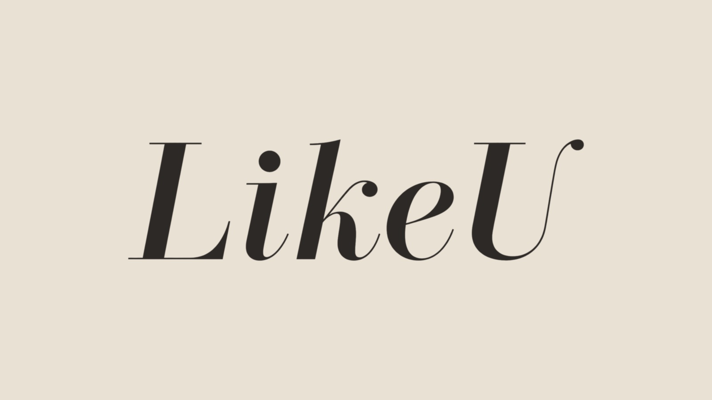

# LikeU 品牌视觉与视频应用规范 V1.0

## 1. 品牌核心

- 品牌名称：`LikeU`
- 名称写法：必须保持大写 `L`、大写 `U`，不得写成 `LIKE U`、`Like U`、`Likeu` 或全大写。
- 视觉关键词：轻高级、亲近、女性化、干净、INS 奶油感。
- 建议品牌感受：让日常穿搭更像自己，而不是强调距离感强的奢侈品符号。
- 字标特征：高对比时装衬线结构；末尾 `U` 使用纤细上扬收笔，作为稳定识别点。

## 2. 正式资产

| 资产 | 用途 | 文件 |
| --- | --- | --- |
| 奶油白透明字标 | 深色、中深色和复杂视频画面 | `assets/brand/likeu/likeu-logo-cream.png` |
| 深墨色透明字标 | 奶油白、浅暖灰和明亮封面 | `assets/brand/likeu/likeu-logo-dark.png` |
| 奶油底预览图 | 文档预览和运营确认 | `assets/brand/likeu/likeu-logo-preview.jpg` |

两张正式字标均为 `1600 × 505` 的透明 PNG，已保留安全留白，可直接进入视频后处理。不要把预览 JPG 当作透明 Logo 上传。

## 3. 标准颜色

| 名称 | 色值 | 使用规则 |
| --- | --- | --- |
| LikeU 奶油白 | `#F7F1E8` | 深色画面的首选 Logo 色 |
| LikeU 深墨色 | `#2D2926` | 浅色画面的首选 Logo 色 |
| INS 奶油底 | `#EAE1D5` | 品牌说明页和浅暖封面底色 |
| 柔金点缀 | `#E8D18B` | 仅用于小面积装饰，不用于主体字标 |

系统 V1 默认使用奶油白字标，并通过轻微文字阴影保障复杂背景上的识别度。不得给字标增加描边、渐变、发光、金属质感或厚重投影。

## 4. 视频首屏应用

- 展示方式：品牌首屏锁定，不做全程常驻大水印。
- 时间：从第 0 帧立即完整显示，持续至约 `0.8 秒` 后淡出；不使用淡入，确保平台直接截取第一帧时也能看到品牌。
- 位置：画面水平居中、中心偏下，视觉中心约在画面高度的 `66%`。
- 宽度：建议占 9:16 画面宽度的 `32%–40%`，不得超过 `44%`。
- 系列副标题：放在字标下方，由系统按商品类别自动生成；例如外套为 `Everyday Outerwear`。
- 动态字幕：默认关闭后续评价字幕，只保留首帧的 LikeU 字标与服装类目标题，让服装展示画面保持干净。
- 封面：可保留同一套居中偏下字标和系列名称，确保主页宫格统一。
- 视频生成模型只负责生成无文字干净原片；Logo 必须由后处理精确叠加，防止拼写和字形漂移。

如果人物上衣主体与默认位置重叠，可在单条人工复核时上下微调，但不得改成每条视频随机位置。

## 5. 留白与最小尺寸

- 四周最小安全留白：不小于大写 `L` 高度的 `0.25 倍`。
- 1080 像素宽竖屏中，字标可见宽度不小于 `300 px`。
- 不得压缩、拉伸、旋转、拆字或单独使用末尾 `U`。
- 不得让字标越过平台 UI 安全区，也不得覆盖商品领口、门襟等关键卖点。

## 6. 飞书账号视觉配置

“账号视觉身份表”中 `PERSONA_001` 建议配置为：

| 字段 | 值 |
| --- | --- |
| 品牌叠加状态 | 启用 |
| 店铺Logo | `likeu-logo-cream.png` |
| 品牌展示名称 | `LikeU` |
| 品牌视觉预设 | 奶油衬线 |
| 品牌主色 | 奶油白 |
| 默认系列名称 | 留空，由商品类型自动生成 |

Logo 或名称调整只重建品牌后处理计划和视频提示词审计信息，不应重新生成产品穿搭图。

## 7. 禁止用法

- 不在左上角或右上角放置唯一且过小的品牌信息。
- 不把 Logo 写入视频模型 Prompt，也不让模型直接生成 Logo。
- 不在同一画面叠加两套 LikeU 字标。
- 不随视频更换字体、颜色、大小或位置。
- 不使用带白底、绿底或奶油底的图片作为正式透明 Logo。
- 不添加与 LikeU 无关的英文装饰词或伪品牌副标题。

## 8. 验收标准

1. `LikeU` 拼写完全准确，透明边缘无绿色残留。
2. 首屏可在手机尺寸下快速识别，但不压过商品主体。
3. 0.8 秒后品牌层消失，后续画面只保留业务字幕。
4. 同批视频的字标位置、比例、颜色和淡入淡出节奏一致。
5. 封面宫格能够形成统一的 LikeU 品牌识别。
